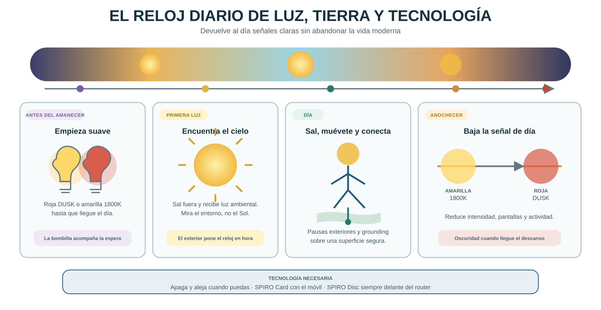
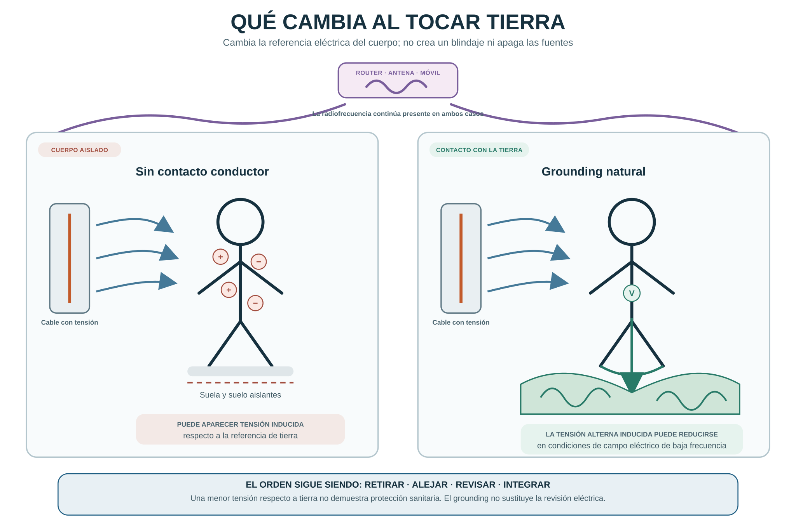

# Capítulo 4 · Volver a salir fuera

Suena el despertador. Enciendes el techo, miras el móvil y sales por el garaje. Trabajas bajo luz artificial, comes dentro y vuelves cuando ya es de noche. Entonces enciendes otra vez el techo.

Has visto la hora cien veces. Tu cuerpo, en cambio, apenas ha recibido señales del día real.

En este capítulo vamos a recuperar tres: la luz del exterior, la transición hacia la noche y el contacto con la tierra. Podemos empezar abriendo una puerta.

## La planta que siguió dando la hora

En 1729, el astrónomo francés Jean-Jacques d'Ortous de Mairan metió una planta de hojas móviles en un armario oscuro. Las hojas siguieron abriéndose de día y cerrándose de noche. El movimiento no dependía de que alguien encendiera el sol.

Tu cuerpo también lleva ritmos dentro: sueño, temperatura, actividad. La luz que entra por los ojos ajusta ese reloj al día exterior, como pones en hora un reloj de pulsera que se ha desfasado.

Para recibir esa señal basta mirar el entorno. No mires directamente al Sol.

## Una habitación luminosa se queda corta

Una lámpara te permite leer y, aun así, da muchísima menos luz que la calle. Puede que tu salón bien iluminado tenga cien veces menos luz que un día nublado.

En 2013, Kenneth Wright y su equipo se llevaron a ocho adultos una semana de acampada, con luz natural de día y oscuridad de noche, sin electricidad. Su reloj interno, medido por la melatonina, se alineó con el sol. Fue una semana entera de condiciones, no una salida de tres minutos.

La acción doméstica es sencilla: acerca tus actividades a la luz del día y añade salidas que puedas repetir. Trabajar junto a una ventana ayuda; caminar fuera cambia además la intensidad, la distancia a la que miras y el movimiento.

> **FIGURA 4.1 · El reloj diario de luz, tierra y tecnología.** Franja del día de noche a noche, con cuatro tarjetas: antes del amanecer (empieza suave), primera luz (encuentra el cielo), día (sal, muévete, pisa tierra), anochecer (baja la señal de día). Referencia Codex: `reloj-natural-diario`, unificando con la figura 2.2.

## Amanecer y anochecer: dos señales distintas

El comienzo del día y la llegada de la oscuridad ayudan a poner el reloj en hora. El efecto de la luz depende de cuándo la recibes, de su intensidad, de su color y de cuánto dura.

En el año 2000, Konstantin Danilenko y sus colaboradores simularon amaneceres en el dormitorio de voluntarios. Un amanecer artificial adelantó el inicio de la melatonina unos veinte minutos; tres amaneceres, unos treinta y cuatro. Es una muestra de lo rápido que responde el reloj, no una receta.

Sal durante la primera parte de tu mañana y busca también una transición tranquila al anochecer. Si trabajas de noche, tu luz y tu sueño necesitan otro horario; el amanecer no siempre es la señal que te conviene justo antes de acostarte.

### La melatonina tiene más de una función

La melatonina que produce la glándula pineal sigue un ritmo nocturno y la luz de noche la frena. Pero también se produce melatonina en otros tejidos, con funciones locales, y se estudia dentro de las mitocondrias, las centrales de energía de la célula.

Una revisión de 2023 propone que el infrarrojo cercano, esa parte de la luz del sol que sentimos como calor, podría participar en esa producción local. Es una línea de investigación, no una prueba de que mirar el amanecer suba tu melatonina en una cantidad concreta.

Lo que haces tú: reforzar la diferencia entre día y noche. Luz exterior mientras estás activo, transición al anochecer y oscuridad para dormir.

## Una mañana que cabe en tu vida

Une la salida a algo que ya haces: sacar al perro, llevar a los niños, tomar el café en una terraza, ir a por el pan. Un cielo nublado sigue siendo exterior.

Si te levantas antes del amanecer, usa una luz suave que te deje moverte con seguridad: la amarilla de 1800 K o la roja DUSK. Después busca el día. La bombilla no sustituye al cielo.

Durante la jornada, aprovecha una pausa, una comida o una llamada para salir. Busca sombra, ropa y protección según la estación, el índice UV y tu piel. Si tienes una enfermedad ocular o cutánea, o tomas medicación que te sensibiliza a la luz, adapta la exposición con quien conoce tu caso.

La luz exterior también llega a la sombra. El objetivo del paseo es volver con ganas de repetirlo.

## Cuando el reloj llega a la célula

El tiempo biológico también entra en el metabolismo. En 2009, Yasukazu Nakahata y su equipo describieron en el laboratorio cómo las proteínas del reloj celular regulan la producción de una molécula necesaria para la energía, el NAD+. Es decir: tu reloj no solo decide cuándo tienes sueño, también cuándo tus células fabrican energía.

Este es uno de los enlaces que me interesa reunir bajo electrobiofotónica: bioelectricidad, luz y organización de la vida. El concepto relaciona preguntas; cada respuesta necesita sus propias pruebas.

## Grounding: tocar la Tierra

Te quitas los zapatos sobre arena o césped. Bajo los pies vuelve un contacto que las suelas de goma interrumpen todo el día.

El grounding es el contacto conductor entre tu cuerpo y la Tierra. Cambia la tensión eléctrica de tu cuerpo respecto al suelo: un estudio de 2016 midió esa tensión en cincuenta personas y vio que bajaba mucho al conectarse a tierra. Eso no apaga las fuentes del entorno ni te protege de la radiofrecuencia. Es otra cosa.

Algunos estudios pequeños han explorado efectos sobre el sueño, el cortisol o el ritmo cardíaco: doce personas en 2004, veintiocho en 2010, en trabajos de investigadores vinculados al movimiento del grounding. Su tamaño limita lo que se puede concluir.

Yo lo incluyo como lo que es: un contacto natural que acompaña al paseo y al descanso fuera. Si te resulta agradable y es seguro, hazlo. No hace falta atribuirle todos los efectos de estar al aire libre.

> **FIGURA 4.2 · Qué cambia al tocar tierra.** Dos figuras humanas junto a un cable con tensión: una sobre suela aislante (puede aparecer tensión inducida en el cuerpo), otra descalza sobre hierba (esa tensión baja). Arriba, un router: "la radiofrecuencia sigue presente en los dos casos". Pie: "Menos tensión respecto a tierra no es protección sanitaria; el grounding no sustituye la revisión eléctrica". Referencia Codex: `grounding-paraguas-natural`, sin que las curvas tapen el texto.

Una toma de tierra de seguridad es parte de la instalación eléctrica; el grounding corporal es otra práctica. No improvises cables hacia enchufes, tuberías ni estructuras metálicas. Un sistema para interior necesita instalación comprobada, producto diseñado para eso y sus instrucciones.

## Receta 1 — Una mañana que el cuerpo pueda reconocer

**Necesitas:** cinco minutos al levantarte. **Resultado:** una salida unida a tu rutina.

1. **Si aún es de noche, ilumina solo lo necesario.** Luz suave, suficiente para ver escalones.
2. **Cuando haya luz, sal.** Cinco o diez minutos sirven para crear el hábito. Mira el entorno, nunca el Sol.
3. **Aparta la pantalla.** Camina o siéntate fuera sin pasar la salida mirando el móvil.
4. **Anota la rutina una semana.** Hora de salida, hora de acostarte y cómo descansas. Para ajustar, no para diagnosticar.

## Receta 2 — Grounding sin montar un laboratorio

**Necesitas:** un trozo de tierra, césped o arena. **Resultado:** probar un contacto natural cómodo y seguro.

1. **Elige suelo seguro.** Sin cristales, sin contaminación, sin temperaturas extremas. Si tienes pérdida de sensibilidad en los pies, heridas o problemas de circulación, no camines descalzo sin consultar.
2. **Ponte cómodo.** Sentado, caminando o con las manos en la tierra del jardín. No aguantes molestias para cumplir un tiempo.
3. **Mira el conjunto.** Luz, movimiento, descanso y contacto ocurren a la vez. Si te encuentras mejor, no sabrás cuál fue.
4. **Para interior, un sistema adecuado.** Con instalación confirmada e instrucciones. Nunca una conexión casera.

## Receta 3 — Devolver el anochecer a la casa

En 2015, Anne-Marie Chang y sus colaboradores pusieron a doce adultos a leer cuatro horas antes de dormir, cinco noches seguidas: unas noches en una pantalla luminosa, otras en papel. Con la pantalla, la melatonina se retrasó, tardaron más en dormirse y estaban menos despiertos a la mañana siguiente. Eran condiciones intensas, pero la lección sirve para cualquier casa: las últimas horas del día no son horas de pantalla.

**Necesitas:** las dos bombillas y una hora de cierre. **Resultado:** una noche que empieza antes de meterte en la cama.

1. **Al anochecer, baja la intensidad.** Entra la amarilla de 1800 K como luz de ambiente.
2. **Al acercarse el descanso, cierra las pantallas.** Luz tenue para lo necesario; la roja DUSK es otra opción. El color no compensa una intensidad excesiva.
3. **Para dormir, apaga.** Si necesitas una luz de paso, la mínima útil y fuera de los ojos. Que el recorrido se vea para no caerte.
4. **Los paneles, para su uso.** Una sesión de luz tiene parámetros y objetivo. En el capítulo siguiente aprenderás a leerlos.

## Antes de volver dentro

Elige un cambio para mañana: un paseo al levantarte o una hora de cierre de pantallas. Organiza primero ese momento. La regularidad es lo que convierte una idea del libro en parte de tu casa.

**En una frase:** tu cuerpo espera cada día tres cosas que ya no le das: el cielo por la mañana, la oscuridad por la noche y la tierra bajo los pies.
