# Electrobiofotónica

## Guía práctica de higiene electromagnética, luz y tecnología que te cuida

### Javier Andrés

Fundador y director de EKIO Electrosmog

> Nota de producción: título de trabajo. Alternativa propuesta en la revisión de septiembre: **Oasis Electromagnético. Guía práctica de higiene electromagnética y luz para toda la familia.** Decisión pendiente de Javier antes de portada y metadatos.

---

## Derechos y edición

Copyright © 2026 Javier Andrés. Todos los derechos reservados.

Primera edición: 2026.
Publicado por EKIO Electrosmog. electrosmogespana.com

ISBN-13 de la edición impresa: [PENDIENTE]
Depósito legal: [PENDIENTE]
Ilustraciones, esquemas, diseño y maquetación: Mauro Arroyo
Corrección editorial: [PENDIENTE]

Queda prohibida la reproducción, distribución, comunicación pública o transformación total o parcial de esta obra sin la autorización escrita del titular de los derechos, salvo en los casos permitidos por la ley.

SPIRO® y las demás marcas citadas pertenecen a sus titulares. Se nombran para identificar los productos de los que se habla.

Las direcciones web y los códigos QR se comprobaron al cerrar esta edición. Lo que hay detrás de ellos se irá actualizando después de la impresión: esa es su función.

---

## Antes de empezar: cuatro cosas que debes saber

**Este libro es divulgativo.** Te explica, con palabras normales, qué hay en tu casa que no ves, qué hace la luz en tu cuerpo y qué puedes cambiar hoy. No diagnostica enfermedades ni sustituye a tu médico, a tu pediatra o a tu veterinario. Si tienes síntomas, una enfermedad, un implante, tomas medicación que te hace sensible a la luz, estás embarazada o quieres aplicar luz a un niño o a un animal, pregunta antes a quien conoce tu caso.

**La electricidad se respeta.** No abras el cuadro eléctrico, no toques cableado ni instalaciones solares sin estar cualificado. Si hueles a quemado, ves chispas, humo, marcas oscuras, cables pelados, enchufes calientes o los automáticos saltan una y otra vez, deja de usar ese aparato y llama a un profesional. Antes que cualquier otra cosa de este libro.

**Separo lo que sabemos de lo que estamos aprendiendo.** Cuando cito un estudio digo cuántas personas participaron y qué se midió. Cuando algo es una hipótesis, lo llamo hipótesis. Cuando es lo que dice un fabricante, lo digo. Y cuando es mi experiencia de quince años entrando en casas, también lo digo, porque es mía y la defiendo.

**Vivo de esto.** Soy el fundador de EKIO. EKIO distribuye SPIRO y desarrolla EKIO Light. Gano dinero si compras esos productos. Te lo cuento en la primera página para que leas todo lo demás sabiéndolo. Todo lo que puedes hacer gratis en este libro está antes que cualquier producto, y funciona igual sin ellos.

---

## Dedicatoria

A las personas que han tenido que explicar lo que otros no podían ver.

Y a quienes siguen buscando una forma más consciente de habitar la tecnología.

---

## Índice

Por qué escribí este libro
Cómo utilizar este libro

1. La casa invisible
   Campo eléctrico, campo magnético, radiofrecuencia y electricidad sucia. Una cuerda y una valla.
2. Un recorrido por tu hogar
   Dormitorio, cocina, salón y despacho.
3. El teléfono que llevas encima
   Móvil, router, conexiones, SPIRO y el coche eléctrico.
4. Volver a salir fuera
   Luz natural, el reloj del cuerpo y pisar la tierra.
5. Usar la luz en casa
   Bombillas para vivir, paneles para una sesión.
6. Niños y adolescentes
   Dormitorio, pantallas, estudio, patio y el primer móvil.
7. Mascotas
   Dónde duermen, qué les rodea, la luz que no reciben.
8. Tu plan de higiene electromagnética
   Prioridades, revisión de diez minutos y semana OASIS.

Páginas finales
   Índice de recetas · Índice de figuras · Glosario · Bibliografía · Agradecimientos · Recursos de EKIO · Para contar este libro en dos minutos · Sobre el autor · Nota de la edición

Los números de página se añadirán tras la maquetación.

---

## Cómo utilizar este libro

Puedes leerlo del principio al final. También puedes abrirlo por la habitación que te preocupa o por la pregunta que tienes hoy.

Si vas a preparar el dormitorio, empieza por los capítulos 1 y 2. Si la duda es el móvil o el router, ve al 3. Si quieres recuperar la luz del día y el anochecer, el 4. Si tienes o quieres un panel de luz, el 5. Los capítulos 6 y 7 son para tus hijos y tus animales. El 8 lo convierte todo en un plan de una semana.

Encontrarás cuatro tipos de contenido:

- **Historias.** De inventores, de casas, de una niña que no tiene sueño y de un perro que tarda una eternidad en elegir dónde parar.
- **Figuras.** Dibujos para ver lo que no se ve.
- **Recetas.** Una acción concreta, con lo que necesitas y lo que consigues, para aplicarla sin releer el capítulo.
- **Fuentes.** Al final del libro, para quien quiera comprobar de dónde sale cada dato.

En cada habitación aplicaremos el método **OASIS**:

- **O**bservar: qué fuentes hay y dónde pasas tiempo.
- **A**lejar o apagar: lo que no hace falta, fuera; lo que hace falta, más lejos.
- **S**anear: revisar instalación, cables y toma de tierra.
- **I**ntegrar: organizar la tecnología que sí necesitas, y si quieres, las soluciones que usamos en EKIO.
- **S**incronizar: luz, actividad y descanso en el orden que el cuerpo espera.

Llamamos **Oasis Electromagnético** a un espacio revisado con ese criterio: menos fuentes evitables, más distancia respecto a las necesarias y una luz pensada para lo que haces y para la hora que es. Es el nombre de nuestra forma de trabajar, no un certificado de que ahí no hay campos.

Usa un lápiz. Dibuja tu casa, marca tres cambios y ponles fecha. La higiene electromagnética funciona como hábito, no como una obra de un fin de semana.

Los dos códigos QR del final te llevan a la web y al canal de YouTube de EKIO. Ahí están la app, los tests, las fichas de cada producto y los vídeos, que se irán renovando. Lo esencial está en estas páginas.

Empieza por el lugar donde duermes.
# Por qué escribí este libro

Soy Javier Andrés. Llevo al frente de EKIO desde 2011. Soy naturópata, y mi interés por lo que hay dentro de nuestras casas empezó escuchando a personas que lo estaban pasando mal.

Entre 2011 y 2012 empecé a trabajar con personas con sensibilidad química múltiple y electrohipersensibilidad. Me marcaron dos cosas: su sufrimiento y la incomprensión que encontraban, muchas veces en su propia familia. Desde entonces no he dejado de buscar maneras de ayudarlas.

Escuchar a alguien no obliga a dar por demostrada la causa de cada síntoma. Sí obliga a tomarse en serio lo que le pasa. Con esa actitud he escrito este libro.

## Lo que he visto en quince años

He entrado en cientos de casas. Casi todas tienen algo en común: nadie mira debajo de la cama.

He visto cabeceros pegados al cuadro eléctrico del piso. Routers en la mesita de noche "porque ahí llega mejor". Regletas con ocho cargadores bajo el sofá donde duerme el perro. Dormitorios infantiles con más aparatos encendidos de noche que un puesto de guardia. Salones iluminados a las once de la noche como una oficina a las once de la mañana. Y personas que llevaban años sin pisar la tierra descalzas ni ver amanecer.

También he visto lo que pasa cuando se ordena eso. No siempre. No en todos. Pero muchas veces la persona que dormía mal empieza a dormir. El niño que no había forma de acostar se acuesta. El animal que se escondía deja de esconderse. Yo no puedo demostrarte con un estudio que fue el cable, o el router, o la luz. Casi siempre se cambian varias cosas a la vez. Lo que te puedo decir es que lo he visto suficientes veces como para escribir este libro.

Sobre la electrohipersensibilidad, para que lo sepas desde ahora: en España no está reconocida como enfermedad. En Suecia se trata como una discapacidad funcional desde hace años. La Organización Mundial de la Salud dice que los síntomas son reales y que no se ha establecido la causa. Yo trabajo con esas personas desde 2011. Existen, sufren y merecen que alguien mire su casa con ellas. Eso es lo que hago.

## De qué va este libro, en una frase

Vivimos dentro de cajas. Salimos poco, vemos el sol a través de un cristal, no tocamos el suelo, dormimos rodeados de aparatos y nos iluminamos igual a mediodía que a medianoche. Ningún cuerpo humano ha vivido así hasta hace dos generaciones.

Este libro no te va a pedir que vuelvas a la cueva. Te va a enseñar a mirar tu casa, a entender cuatro cosas que no se ven, a recuperar tres señales que tu cuerpo espera cada día (luz, oscuridad y tierra) y a elegir qué tecnología conservas y a qué distancia.

## Una casa que puedes aprender a mirar

Empieza sin comprar nada. Mira a tu alrededor: un cargador enchufado que ya no carga nada, una regleta junto al cabecero, una lámpara demasiado fuerte para la última hora del día.

¿Lo necesitas ahí? ¿Tiene que seguir encendido? ¿Puedes ponerlo en otro sitio?

No te voy a dar una lista interminable de aparatos. Prefiero que aprendas a reconocer las fuentes, a valorar la distancia y el tiempo, y a elegir un cambio que puedas mantener.

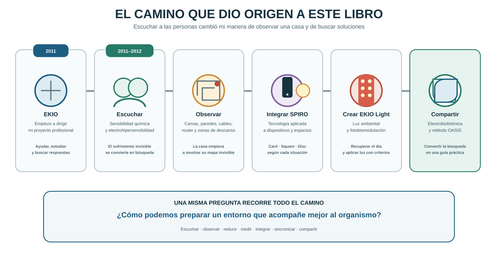

> **FIGURA P.1 · El camino que dio origen a este libro.** Línea con seis pasos: 2011 EKIO · Escuchar (SQM y EHS) · Observar casas · Integrar SPIRO · Crear EKIO Light · Compartir (este libro). Debajo, la pregunta que recorre todo: "¿Cómo preparamos un entorno que acompañe al organismo?". Referencia de contenido: esquema Codex `camino-electrobiofotonica`.

Primero quitamos lo que sobra. Después alejamos lo que debe seguir funcionando. Revisamos la instalación y medimos si hace falta. Y a partir de ahí, valoramos qué soluciones encajan en cada casa.

## Las soluciones con las que trabajo

Aquella búsqueda me llevó a distribuir SPIRO y a crear EKIO Light, nuestra marca de bombillas de luz cálida y roja y de paneles de fotobiomodulación. Por eso aparecen en estas páginas. Vendo SPIRO y soy el fundador de EKIO: lo sabes desde la primera página y lo repetiré cuando toque.

Con SPIRO aprenderás a ordenar la tecnología que decides conservar. Con EKIO Light aprenderás a distinguir dos cosas que la gente confunde: iluminar una habitación y hacer una sesión de luz. Para la primera importa cuánta luz y a qué hora. Para la segunda importan también el color exacto, la potencia, la distancia y el tiempo.

De todo lo que vendo, lo que más recomiendo en este libro es lo más barato: dos bombillas. Una amarilla muy cálida para el anochecer y una roja para las últimas horas. Porque el cambio más grande que puedes hacer en tu casa es dejar de tratar a la noche como si fuera de día.

## Una palabra para mirar el conjunto

Uso **electrobiofotónica** como hilo conductor: electricidad, biología y luz, juntas. Las células mantienen pequeñas diferencias de tensión. La luz pone en hora nuestros ritmos y, aplicada con ciertos parámetros, cambia procesos biológicos. Es mi forma de ordenar esta guía, no el nombre de una especialidad médica.

Entenderlo ayuda a hacer mejores preguntas. Qué hay junto a tu cama. Qué pasa cuando cocinas. Cómo usas el móvil. Cuánta luz recibes de día y cuánta te sobra de noche.

## Lee una idea y haz algo con ella

He escrito esto para leerlo con un lápiz en la mano. Vamos a reconocer cuatro capas de tu casa, a recorrer el dormitorio, la cocina, el salón y el despacho, a revisar el móvil, a salir a buscar luz y a aprender a usarla dentro. Los niños tendrán su capítulo. Las mascotas, otro. Al final elegirás tres cambios y tendrás un plan de siete días.

Te propongo el primero ahora: elige el sitio donde más horas descansas y apunta una cosa que quieras revisar. No hace falta resolverla todavía. Solo verla.

Por ahí empieza el camino.

**En una frase:** llevamos dos generaciones viviendo de una forma para la que el cuerpo no está hecho; este libro te enseña a mirar tu casa y a devolverle al día su luz, a la noche su oscuridad y a tus pies la tierra.
# Capítulo 1 · La casa invisible

Abres la puerta y dejas las llaves. El sofá está donde lo dejaste, el router parpadea y un cargador espera en su enchufe aunque no tenga teléfono.

La casa parece en silencio. Si pudieras ver lo que hay alrededor de cables y aparatos, verías otra actividad: corrientes, señales que van por el aire y ruidos que viajan por la instalación.

Vamos a aprender a distinguirlos. Llamar "contaminación electromagnética" a todo, sin separar sus partes, sería como intentar arreglar todos los muebles de casa con el mismo martillo.

## El experimento que cabe en una mano

En 1831, Michael Faraday movió un imán junto a una bobina conectada a un aparato que detectaba corriente. La aguja se movió. Cuando dejó de mover el imán, la corriente desapareció.

Ese gesto sigue funcionando en cada generador y cada transformador del mundo. Y nos da la primera lección: electricidad y magnetismo van juntos, pero en tu casa conviene mirarlos por separado.

## Cuatro lentes para mirar lo que no ves

Imagina una rueda de enfoque. Con un giro ves una habitación; con otro, una célula; con otro, una molécula.

- **Macroescala:** casa, cuerpo, cama, cable. Metros y centímetros.
- **Microescala:** células y microbios. Un microscopio normal distingue cosas separadas por dos décimas de milésima de milímetro.
- **Nanoescala:** membranas, proteínas, moléculas. Un nanómetro es la milmillonésima parte de un metro.
- **Ondas:** aquí no medimos tamaños, sino cuántas veces por segundo oscila algo (frecuencia) y cuánto mide cada oscilación (longitud de onda).

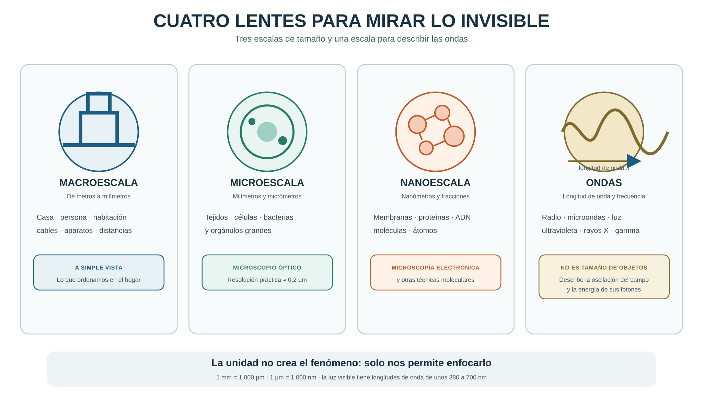

> **FIGURA 1.1 · Cuatro lentes para mirar lo invisible.** Cuatro tarjetas: casa, célula, molécula, onda. Al pie: "1 mm = 1000 µm · 1 µm = 1000 nm · la luz visible va de unos 380 a 700 nm". Referencia Codex: `cuatro-escalas-observacion`.

Las tres primeras describen tamaños. La cuarta ordena el espectro. Una proteína y una onda pueden medirse en nanómetros aunque estemos midiendo cosas distintas.

## Del enchufe a los rayos gamma

El espectro electromagnético reúne, de menos a más frecuencia: radio, microondas, infrarrojo, luz visible, ultravioleta, rayos X y rayos gamma. Las microondas son, por convenio, parte de las ondas de radio; se dibujan aparte para situar mejor sus usos.

El móvil, el Wi-Fi, el Bluetooth y muchos radares usan bandas de radio y microondas. La red eléctrica de tu casa funciona a 50 hercios, una frecuencia muchísimo más baja. Cerca de un cable no hay "una señal de radio": hay un campo eléctrico y un campo magnético que se estudian por separado.

La luz visible ocupa, más o menos, de 380 a 700 nanómetros: violeta en un extremo, rojo en el otro. Después del rojo viene el infrarrojo, que no vemos pero sentimos como calor. Antes del violeta viene el ultravioleta.

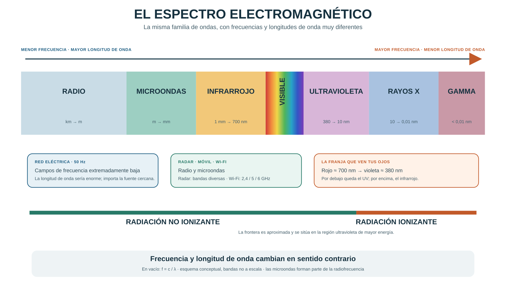

> **FIGURA 1.2 · El espectro electromagnético.** Banda continua de radio a gamma con la franja visible en color. Tres recuadros: "Red eléctrica 50 Hz", "Radar · móvil · Wi-Fi", "Lo que ven tus ojos". Debajo, la línea "no ionizante / ionizante" con la frontera en el ultravioleta alto. Referencia Codex: `espectro-electromagnetico`.

El dibujo ordena frecuencias, no peligros. Los rayos X, los gamma y el ultravioleta más energético pueden romper enlaces en la materia: son radiación ionizante. La radiofrecuencia, el infrarrojo y la luz visible no lo son. Para valorar una exposición hacen falta, además, intensidad, frecuencia, tiempo y condiciones.

## Cuatro cosas que conviene separar

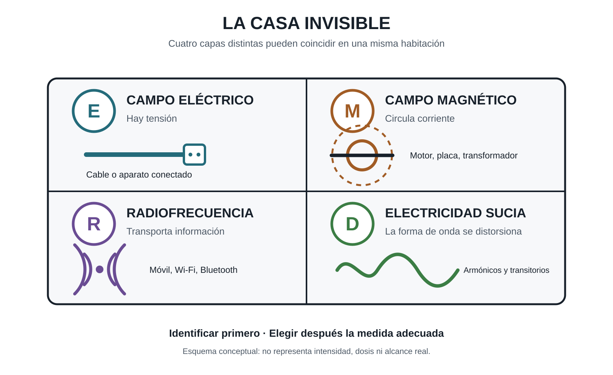

> **FIGURA 1.3 · Las cuatro capas de tu casa.** Cuadrícula con E (campo eléctrico), M (campo magnético), R (radiofrecuencia) y D (electricidad sucia), cada una con su icono, su color y un ejemplo. **Este código de cuatro letras y cuatro colores se repite idéntico en todo el libro.** Referencia Codex: `cuatro-capas-casa`.

### 1. Campo eléctrico: hay tensión

Piensa en una manguera con presión aunque el grifo esté cerrado. Eso es la tensión eléctrica.

Un cable enchufado mantiene un campo eléctrico aunque el aparato esté apagado. Por eso apagar la lámpara de la mesita y desenchufarla son dos cosas distintas. En España, además, la clavija se puede meter en las dos posiciones, así que el interruptor de la lámpara puede estar cortando el cable "equivocado" y dejar el otro con tensión hasta la bombilla.

Mira la regleta bajo el escritorio, el cargador detrás del sofá y los cables que pasan junto al cabecero.

**Tu acción:** desenchufa una lámpara que no necesites junto a la cama y aparta su cable. Si sospechas del cableado de la pared, apúntalo: desenchufar la lámpara no desconecta la instalación.

### 2. Campo magnético: circula corriente

Abres el grifo y el agua corre. Cuando por un cable circula corriente, aparece un campo magnético. En casa se mide en microteslas (µT) o miligauss (mG): una microtesla son diez miligauss.

El secador, la placa de inducción, el motor del frigorífico y cualquier motor o transformador cambian de estado cuando funcionan. También el cuadro eléctrico.

Imagínate cocinando: la bobina de la inducción trabaja bajo la cazuela mientras tú estás apoyado en el borde. Puedes dar un paso atrás mientras esperas. El tamaño del aparato no lo dice todo: cuentan la corriente, el diseño y dónde estás tú.

**Tu acción:** localiza un motor o un transformador cerca de un sitio donde pasas horas. Si puedes separarlo, sepáralo. Si está al otro lado de una pared, apúntalo para medir.

### 3. Radiofrecuencia: la información viaja por el aire

El router, el móvil, el teléfono inalámbrico de casa, el Bluetooth y el vigilabebés transmiten por radiofrecuencia. Es la forma de mandar voz, imágenes y datos sin cable.

En una tarde, tu móvil pasa del bolsillo a una llamada, de la llamada a descargar fotos y luego a compartir Internet con el portátil. Alrededor siguen las redes de los vecinos y las antenas de la calle.

La emisión cambia con lo que hace el aparato, con la cobertura y con el modelo. Contar aparatos no es medir exposición.

**Tu acción:** mira si el móvil está compartiendo Internet cuando ya no lo necesitas. Apágalo. Y localiza el router respecto a la cama, el sofá y el escritorio.

### 4. Electricidad sucia: ruido en la red

Cargadores, reguladores de luz, controladores de LED, motores con variador e inversores solares convierten o regulan la electricidad. Al hacerlo pueden meter en tus cables un ruido de frecuencias más altas que los 50 hercios de la red.

"Electricidad sucia" es una forma de llamar a ese ruido. No es una sola cosa ni tiene un umbral sanitario oficial.

Un aparato puede funcionar bien y generar ruido por su diseño. Si además está estropeado, hay que repararlo. Si tienes placas solares, el inversor es un punto a revisar. Si usas adaptadores PLC (los que llevan Internet por el enchufe), están metiendo datos a propósito en tu cableado.

**Tu acción:** apunta qué aparatos coinciden con ruidos en la radio o parpadeos raros. Si se repite, pide una comprobación antes de comprar ningún filtro.

## Un aparato puede aparecer cuatro veces

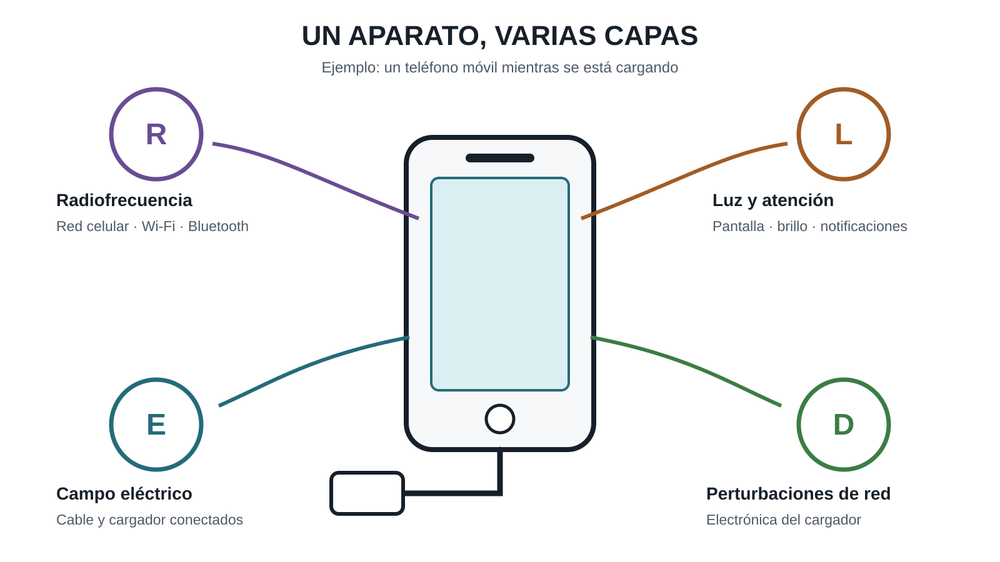

> **FIGURA 1.4 · Un aparato, varias capas.** Un móvil cargando en el centro; alrededor, R (red móvil, Wi-Fi, Bluetooth), E (cable y cargador), D (electrónica del cargador) y L (luz de la pantalla). Nota: la L no es una capa del código; es la señal de hora que damos al cuerpo. Referencia Codex: `un-aparato-varias-capas`.

El móvil transmite por varias redes; su cargador añade un cable con tensión y puede meter ruido; la pantalla da luz. La inducción combina electrónica de potencia y campo magnético. El microondas usa radiofrecuencia dentro de su caja y lleva otros componentes.

Por eso trabajaremos por capas y por uso. Alejarse siempre reduce, aunque no hay una regla mágica del tipo "cada metro divide por cuatro": depende de la fuente, de la geometría y de lo que haya alrededor. La distancia es la herramienta más fiable que tienes. Úsala.

## Cuatro medidores, cuatro preguntas

En EKIO usamos varios instrumentos, cada uno para una pregunta. Te los enseño no para que los compres, sino para que veas que esas cuatro capas son cosas distintas que se miden de formas distintas.

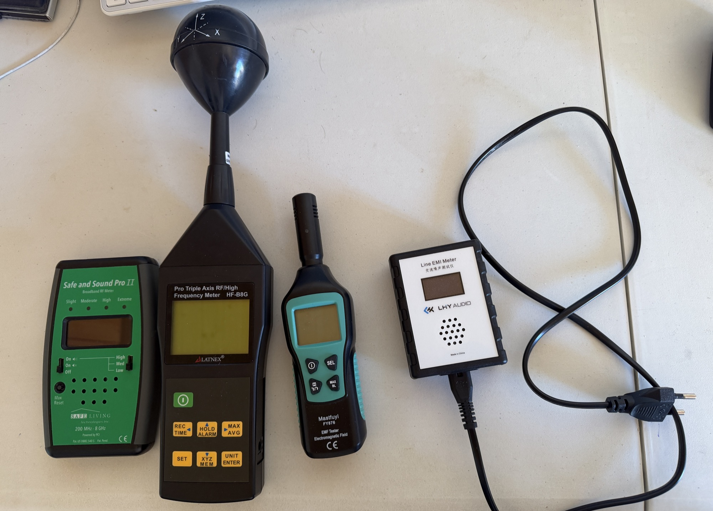

> **FIGURA 1.5 · Los instrumentos que usamos en EKIO.** Fotografía cenital sobre fondo neutro, de izquierda a derecha: medidor de radiofrecuencia de banda ancha (Safe and Sound Pro II), medidor triaxial de radiofrecuencia (LATNEX HF-B8G), medidor de campo eléctrico y magnético (Mastfuyi FY876) y medidor de ruido en la línea (LHY Audio Line EMI Meter). Pie: "Instrumentos que usamos como referencia; los modelos cambian".

- Los dos primeros miden radiofrecuencia: lo que va por el aire.
- El tercero mide campo eléctrico y magnético: lo que rodea a cables y motores.
- El cuarto se enchufa y mide el ruido de la línea: la electricidad sucia.

Para comparar dos medidas conserva el punto, el aparato, la unidad y las condiciones. Una cifra sin contexto es como decir "hace calor" sin decir si estás en la cocina o en la calle. Y una aplicación no convierte tu móvil en un medidor. Cuando la decisión dependa de un número, pide una medición con método.

## Una cuerda y una valla

Vas a leer la palabra "polarización" en fichas de productos y en artículos. Te la explico ahora, con una cuerda.

Ata una cuerda a un árbol y mueve la mano arriba y abajo: la onda avanza oscilando en vertical. Muévela de lado a lado y oscila en horizontal. Esa orientación se llama polarización. Si haces pasar la cuerda entre los barrotes de una valla, solo cruza la onda vertical. Así funcionan las gafas de sol polarizadas: dejan pasar una orientación y frenan la otra.

La luz del sol llega mezclada: oscila en todas las orientaciones a la vez y cambia a cada instante. Nuestro cuerpo ha convivido con esa mezcla desde siempre. Las señales que fabricamos nosotros salen de una antena con una orientación fija y ordenada, porque así se transmiten mejor.

Algunos investigadores proponen que esa diferencia importa: una oscilación siempre en la misma dirección empujaría a los iones de nuestras células (calcio, magnesio, cargas eléctricas pequeñísimas) de forma coordinada, como una ola de estadio, mientras que la mezcla natural los deja tranquilos. Es una hipótesis, con experimentos a favor y en contra. Y es la que usa el fabricante de SPIRO para explicar lo que hace su material: desordenar esa orientación fija para que la señal siga llegando pero deje de empujar en una sola dirección.

*[Figura 1.6 · Una cuerda y una valla — figura nueva, pendiente de Mauro Arroyo]*

> **FIGURA 1.6 · Una cuerda y una valla.** Tres viñetas: (1) cuerda oscilando en vertical y en horizontal, con la valla que solo deja pasar una; (2) sol con ondas en todas las orientaciones frente a antena con ondas todas iguales; (3) iones en una célula: empujones en todas direcciones (se quedan quietos) frente a empujones siempre en la misma dirección (se mueven en bloque). Rótulo: "Hipótesis: así explican algunos investigadores y el fabricante de SPIRO la diferencia entre campos naturales y artificiales". Figura nueva.

No necesitas creer ni descreer nada para seguir con este libro. Te lo cuento porque es la idea que hay detrás de la palabra "polarización" cuando la leas en una ficha. Para quien quiera profundizar, la nota al final del libro recoge los trabajos a favor y en contra.

Lo que haces con esto hoy: nada todavía. Identificar, apagar lo que sobra y ganar distancia va primero.

## El objetivo: crear un Oasis Electromagnético

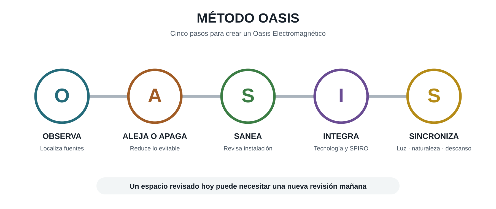

> **FIGURA 1.7 · Método OASIS.** Cinco círculos en línea: O Observa · A Aleja o apaga · S Sanea · I Integra · S Sincroniza. Pie: "Un espacio revisado hoy puede necesitar otra revisión mañana". Referencia Codex: `metodo-oasis`.

- **O — Observa:** fuentes y lugares donde pasas tiempo.
- **A — Aleja o apaga:** fuera lo que sobra; distancia para lo que se queda.
- **S — Sanea:** la revisión eléctrica que corresponda.
- **I — Integra:** la tecnología que necesitas y, si quieres, las soluciones que usamos en EKIO.
- **S — Sincroniza:** luz, actividad y descanso en el orden del día.

## Receta 1 — Dibuja el mapa invisible de tu casa

**Necesitas:** una hoja, un lápiz, quince minutos. **Resultado:** una zona elegida y tres cambios. El plano localiza fuentes; no mide campos.

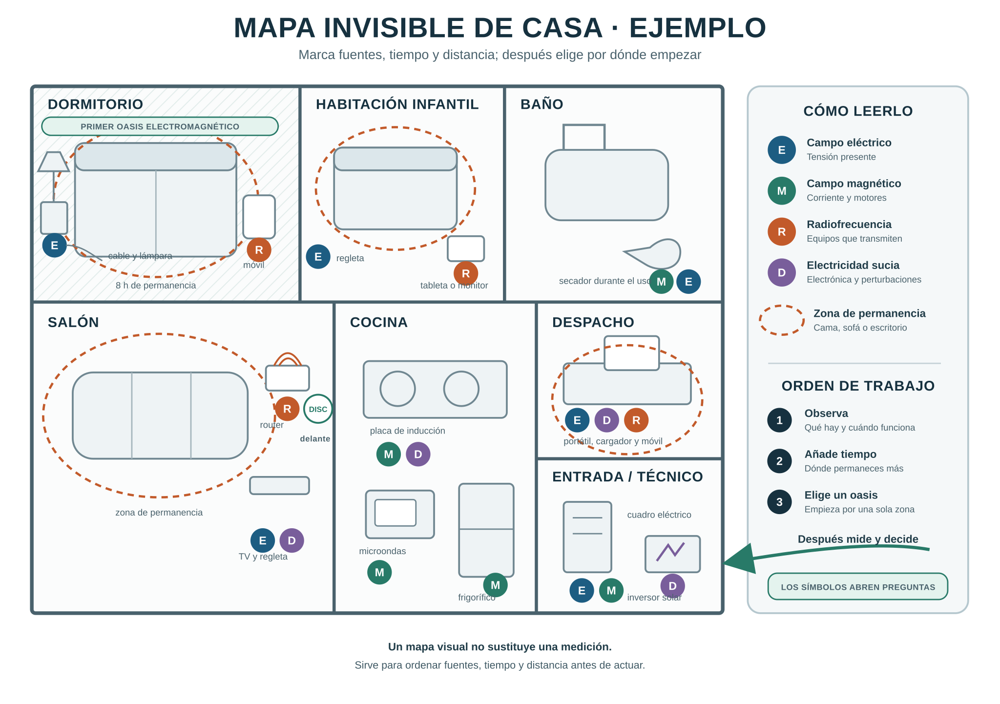

> **FIGURA 1.8 · Mapa invisible de casa, ejemplo.** Planta de un piso con dormitorio, habitación infantil, baño, salón, cocina, despacho y entrada. Letras E, M, R, D con los mismos colores de la figura 1.3 sobre lámpara, regleta, móvil, router, inducción, microondas, frigorífico, cuadro e inversor. Elipses discontinuas en cama, sofá y escritorio ("zona de permanencia"). El dormitorio rayado: "primer Oasis". Leyenda a la derecha. Referencia Codex: `mapa-invisible-casa-ejemplo`, con el código de color corregido.

1. **Dibuja las habitaciones.** Incluye el cuadro eléctrico, el router y el inversor solar si lo tienes.
2. **Marca las capas.** E en cables con tensión; M en motores, transformadores y corrientes; R en lo que transmite; D donde sospeches ruido de red.
3. **Rodea dónde pasas horas.** Cama, sofá, escritorio, zona de juego. Apunta qué fuentes quedan cerca, también al otro lado de la pared.
4. **Elige una zona.** Quita un aparato innecesario, aleja una fuente y apunta una duda para medir o revisar. Si usas SPIRO, anota modelo y sitio.
5. **Pon fecha y guarda el mapa.** Lo actualizarás cuando muevas muebles o entren aparatos nuevos.

No hace falta resolver la casa entera hoy. Dibuja tu dormitorio: entramos en él en el capítulo siguiente.

**En una frase:** en tu casa hay cuatro cosas invisibles que se miden de forma distinta, y la herramienta más fiable contra todas ellas es la misma: distancia.
# Capítulo 2 · Un recorrido por tu hogar

Coge el mapa y ven conmigo. Vamos al dormitorio, la cocina, el salón y el despacho. En cada sitio buscaremos lo mismo: qué hay cerca de tu cuerpo, durante cuánto tiempo y qué puedes cambiar hoy.

En el dormitorio importa la permanencia. En la cocina, la cercanía mientras las cosas funcionan. En el salón, la acumulación. En el despacho, la jornada entera.

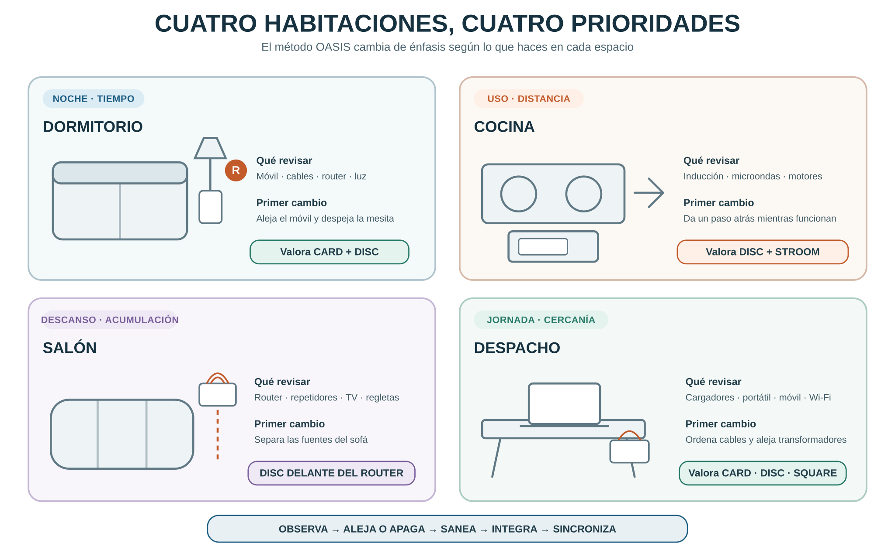

> **FIGURA 2.1 · Cuatro habitaciones, cuatro prioridades.** Cuatro tarjetas (dormitorio: noche y tiempo; cocina: uso y distancia; salón: descanso y acumulación; despacho: jornada y cercanía), cada una con "qué revisar" y "primer cambio". Referencia Codex: `cuatro-habitaciones-oasis`.

Lleva las cinco preguntas de OASIS: ¿qué veo?, ¿qué puedo alejar o apagar?, ¿qué hay que revisar?, ¿qué tecnología conservo?, ¿cómo organizo la luz y el descanso?

## La casa también cambia de luz

La casa no necesita la misma luz a todas horas. Antes de amanecer puedes empezar con luz tenue y cálida, suficiente para vestirte y moverte con seguridad. Cuando llegue el día, busca el exterior. Al acercarse la noche, baja la intensidad.

Aquí entran las dos bombillas que más recomiendo en este libro. La **amarilla de 1800 K** es una luz muy cálida, como la de una vela grande: la "K" es la temperatura de color, y cuanto más bajo el número, más anaranjada y menos azul es la luz. La **roja DUSK** es para los últimos momentos del día y para orientarte de noche.

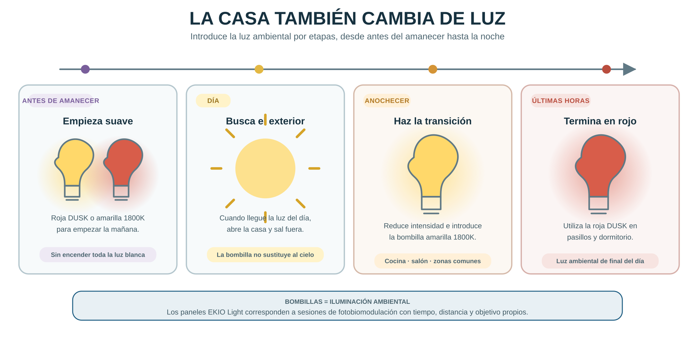

> **FIGURA 2.2 · La casa también cambia de luz.** Línea del día en cuatro tarjetas: antes de amanecer (amarilla o roja, suave), día (sal fuera), anochecer (baja intensidad, amarilla 1800 K), últimas horas (roja DUSK). Pie: "Las bombillas iluminan; los paneles hacen sesiones". Referencia Codex: `transicion-luz-ekio-hogar`.

El color no compensa una intensidad excesiva: una luz roja a tope sigue siendo mucha luz. Y no tienes que cambiar todas las bombillas en una tarde. Empieza por las que usas al levantarte y antes de acostarte.

Empecemos por la habitación en la que menos te mueves.

## Dormitorio · Apagar el día

A ver si te suena.

Te metes en la cama con intención de dormir. Coges el móvil para poner la alarma y ves un mensaje. Lo contestas. Ya que lo tienes en la mano, miras el tiempo de mañana. Luego una noticia, luego un vídeo…

Cuando vuelves a mirar la hora ha pasado casi una hora. Y todavía no has puesto la alarma.

Conectas el cargador, dejas el móvil al lado de la almohada y apagas la lámpara. Pero la regleta sigue bajo la cama, el piloto del portátil sigue encendido, el reloj ilumina la pared y por un lado de la persiana entra la luz de la farola.

El dormitorio no necesita muchos aparatos para reunir varias capas. Un cable enchufado aporta campo eléctrico. Un cargador trabajando usa electrónica de potencia. El móvil habla con la red, con el Wi-Fi o con el Bluetooth. Y la luz añade otra señal: la hora que tu cuerpo cree que es.

### Mira la habitación desde la almohada

Haz algo muy sencillo: túmbate donde duermes y mira desde ahí.

¿Qué queda a menos de un brazo? ¿Hay una regleta bajo la cama? ¿El cabecero comparte pared con el cuadro eléctrico, una televisión o el frigorífico? ¿Dónde está el router? ¿Qué pilotos ves con la luz apagada?

La cama es una zona de permanencia. Algo que usas dos minutos en la cocina no cuenta igual que un cable junto a tu cabeza toda la noche. Y la pared de detrás importa: un cuadro eléctrico o un motor al otro lado del tabique están más cerca de tu almohada de lo que parece.

### Una mosca sabía la hora antes que tu teléfono

En los años setenta, Seymour Benzer y Ronald Konopka estudiaron moscas de la fruta con los ritmos cambiados y encontraron un gen al que llamaron *period*. Los trabajos posteriores de Jeffrey Hall, Michael Rosbash y Michael Young explicaron el reloj molecular de las células y recibieron el Premio Nobel de Fisiología o Medicina de 2017.

Una mosca no consulta una agenda. Su cuerpo lleva el tiempo dentro.

Tú también. Y la luz es lo que pone ese reloj en hora. Una pantalla encendida a las once de la noche le dice al cuerpo que aún es de día. En el capítulo 4 verás el experimento que lo demostró con doce personas y cinco noches.

### Receta 1 — Prepara una mesita que te deje descansar

**Necesitas:** diez minutos y un enchufe fuera del dormitorio. **Resultado:** una noche con menos cosas encendidas junto a tu cabeza.

1. **Decide dónde pasa la noche el móvil.** Lejos de la almohada y, si puedes, fuera del dormitorio. Si tienes que estar localizable, deja solo lo imprescindible. Si no, apágalo o usa el modo avión mirando que Wi-Fi y Bluetooth queden apagados de verdad. Comprueba antes si la alarma funciona como esperas.
2. **Mueve el sitio de carga.** Fuera cargadores y cables que no usas. Carga el móvil sobre una superficie firme, nunca sobre la cama ni bajo la almohada.
3. **Revisa lo que sigue enchufado.** Apagar una lámpara no es desconectarla. Mantén lo esencial; quita los accesorios que no hacen nada de noche.
4. **Reduce las conexiones nocturnas.** Si nadie necesita el router y no sostiene alarmas ni teleasistencia, apágalo. Si lo sustituyes por el punto de acceso del móvil, has vuelto a crear una red.
5. **Si usas SPIRO, colócalo según su función.** La Card va con el móvil, entre la funda y el aparato. El Disc es para el espacio: en el capítulo 3 te cuento dónde y por qué.
6. **Baja también la luz.** Amarilla al anochecer, roja si necesitas orientarte, y apagado al dormir. Un panel EKIO Light se apaga al terminar su sesión; no es una lámpara de dormitorio.

Cuando termines, vuelve a tumbarte. Si has quitado cables, alejado el móvil, bajado las luces y ordenado lo que sigue funcionando, ya tienes tu primer Oasis Electromagnético.

## Cocina · La distancia mientras todo funciona

Entras a preparar el desayuno. Cafetera, frigorífico, sartén sobre la inducción, algo en el microondas. Mientras esperas, dejas el móvil en la encimera y le preguntas al altavoz qué tiempo hará.

La cocina ha pasado del silencio a reunir motores, resistencias, bobinas, electrónica y comunicaciones.

Aquí la prioridad cambia. No duermes junto a la placa, pero sí puedes estar muy cerca mientras trabaja. Tampoco vas a desenchufar el frigorífico cada noche. Lo que necesitas es distinguir lo esencial de lo que solo espera el próximo uso.

### La placa de inducción no calienta como una resistencia

Bajo el cristal hay una bobina con corriente variable. Su campo magnético induce corrientes en la cazuela, y esas corrientes calientan.

Por eso importan la cazuela, su posición y la tuya. Usa recipientes compatibles, céntralos sobre la zona y no te apoyes en el borde mientras la placa trabaja. Si no tienes que remover, da un paso atrás. Un estudio suizo de 2012 midió varias placas y encontró que muchas cumplen los límites a la distancia de la norma, treinta centímetros, y los superan si te pegas al borde. El paso atrás no es manía: es la distancia que marca la norma.

### El microondas tiene una habitación dentro de la habitación

El microondas genera radiofrecuencia y la encierra en una caja metálica para calentar la comida. La puerta, los cierres y las juntas forman parte del sistema, y hay un mecanismo que corta la emisión cuando la puerta se abre.

Míralo como una olla a presión: no le tengas miedo, pero mantenlo en buen estado. Si la puerta está deformada, no cierra bien o el aparato sigue funcionando al abrirla, deja de usarlo y llévalo a revisar. Y mientras trabaja, no hace falta pegar la cara al cristal para ver si la sopa sigue ahí. Te prometo que no se escapa.

### Un aparato puede funcionar bien y aun así estar en el mapa

Luces LED, cafetera, horno, lavadora, cualquier electrodoméstico con control de velocidad: llevan fuentes conmutadas, es decir, electrónica que convierte la corriente muchas veces por segundo. Funcionan perfectamente y, por diseño, pueden meter ruido en la red. Si además hay avería, eso es cosa de un técnico: son dos situaciones distintas.

Si tienes placas solares, localiza el inversor. Ahí la electrónica convierte la corriente de los paneles en la de tu casa, trabaja con conmutaciones y corrientes grandes, y puede producir campo magnético cerca y ruido en los cables. Si puedes elegir dónde va, que no sea al otro lado de un cabecero, un sofá o una mesa de trabajo.

En EKIO, cuando hay inversor, colocamos un SPIRO Disc X junto a él, siguiendo su orientación y distancia. Antes se mide la zona y se revisa la instalación. No lo describo como un filtro de línea ni como algo que baja el campo magnético del medidor: son funciones distintas. Y si se confirma electricidad sucia en los cables, la solución para la línea se estudia aparte.

### Receta 2 — Cocina sin vivir pegado a los aparatos

**Necesitas:** cinco minutos y tu triángulo de trabajo. **Resultado:** cocinar igual, con más espacio entre tú y las fuentes activas.

1. **Dibuja tu triángulo.** Placa, microondas y el sitio donde preparas. Mira si puedes trabajar sin estar apoyado sobre una fuente activa.
2. **Gana distancia mientras funcionan.** Centra la cazuela y da un paso atrás cuando no tengas que intervenir. Lo mismo con el microondas.
3. **Revisa puertas, cables y enchufes.** Sin microondas con la puerta dañada, sin cables deteriorados, sin regletas improvisadas junto al agua o el calor.
4. **Desenchufa lo ocasional.** Lo que usas una vez por semana no necesita un enchufe fijo. Mantén el frigorífico, la seguridad y lo que de verdad lo requiera.
5. **Ordena las conexiones.** Si el altavoz, una pantalla o un electrodoméstico conectado no aporta nada a tu rutina, desactiva esa función. Un horno no cocina mejor por saberse la contraseña del Wi-Fi.
6. **Integra la solución del espacio.** En una cocina con varias fuentes, un SPIRO Disc puede formar parte de la organización general. Si hay electricidad sucia medida en los cables, el Stroom Master es otra herramienta, con otra función.
7. **Ilumina la tarea.** Al final del día, luz general baja y luz suficiente para manejar cuchillos y cazuelas.

La cocina está bien cuando puedes moverte, usar cada aparato con propósito y dejar la encimera sin un cementerio de cargadores.

## Salón · El lugar donde todo se reúne

El salón tiene una habilidad especial: atrae aparatos.

Empieza con una televisión. Después llegan el router, la consola, el decodificador, la barra de sonido, el repetidor Wi-Fi, los mandos, el altavoz inteligente y una regleta con tantos ocupantes que necesitaría un presidente de comunidad.

El problema no es un aparato. Es la concentración alrededor del sofá, donde puedes pasar varias horas sin moverte.

### Revisa el sofá antes que la televisión

Siéntate donde sueles descansar. Mira delante, detrás y al otro lado de las paredes.

Quizá el router esté escondido detrás del respaldo porque ahí no se ve. Puede que la regleta esté bajo tus pies, o que al otro lado del tabique esté el cuadro eléctrico. Puede haber un repetidor cuyo único trabajo es acercar la red inalámbrica al sofá.

No decidas mirando solo el frontal de los aparatos. Los transformadores, cables y fuentes de alimentación se quedan detrás del mueble, justo donde nadie los recuerda.

### El televisor apagado puede seguir esperando

Muchos equipos mantienen funciones de espera, actualización o encendido remoto. Puede ser útil, pero conviene saber qué aparatos lo hacen.

No cortes la alimentación de todo sin comprobar consecuencias. Algunos equipos necesitan actualizarse o guardar configuraciones. Otros pueden pasar días desconectados sin que pase nada. Lee el manual y agrupa solo los compatibles en una regleta con interruptor de calidad.

### Receta 3 — Devuelve espacio al salón

**Necesitas:** una tarde y, si es viable, un cable de red. **Resultado:** cada aparato con un motivo y un sitio.

1. **La prueba del asiento.** Desde el sofá, localiza router, repetidores, regletas, cargadores y la pared de al lado. Rodéalo en tu mapa.
2. **Mueve el router.** Si debes conservarlo, que no esté pegado al sofá. Busca un punto con servicio y más separación de donde estáis. No lo encierres sin ventilación.
3. **Cablea lo que no se mueve.** Televisor y consola están siempre en el mismo sitio. Si admiten cable de red, conéctalos y desactiva la radio que ya no necesiten.
4. **Elimina redes duplicadas.** Router, red de invitados, repetidores, puntos de acceso. Deja solo los que cumplen una función.
5. **Ordena la alimentación.** Fuera cargadores abandonados; fuentes de alimentación lejos de pies y cabeza; nada tapado con alfombras o cojines.
6. **Si usas SPIRO, el Disc va delante del router.** Por qué, en el capítulo 3. Si hay un ordenador u otra fuente concentrada, puede corresponder un Square.
7. **Prepara el final del día.** Luz ambiental baja y pantallas cerradas antes de dormir. Apagar el televisor y apagar el router son decisiones distintas.

Cuando acabes, el salón seguirá teniendo tecnología. La diferencia es que sabrás por qué está cada cosa.

## Despacho · Ocho horas cuentan

En el despacho casi nada parece espectacular. Un portátil, un monitor, un cargador, una lámpara y el teléfono. Pero estás ahí buena parte del día.

La cercanía se repite: el adaptador bajo los pies, la regleta junto a la pierna, el portátil sobre las rodillas, los auriculares puestos, el router a un metro y el móvil en el bolsillo. Y encima, la luz, el tiempo sentado y las horas de pantalla.

No atribuyas todo el cansancio al campo ni todo a la postura. Ordena cada cosa para que el sitio te exija menos.

### El cargador también necesita respirar

Los adaptadores transforman la corriente y es normal que se calienten. Deben estar ventilados, sobre una superficie estable y lejos de mantas, cojines o alfombras gruesas.

El portátil tampoco debería trabajar enterrado en la cama o sobre tu cuerpo. Una mesa firme mejora la ventilación y, de paso, te separa de la electrónica.

### La mesa tiene una parte invisible

Agáchate y mira debajo.

Es posible que encuentres dos regletas enchufadas una en otra, cargadores que ya no reconoces, un transformador donde pones los pies y un adaptador PLC metiendo datos por el cableado.

No tires de todos los cables a la vez. Identifica, etiqueta y quita lo que no alimenta nada. Si hay conexiones recalentadas o clavijas flojas, que lo reorganice un electricista.

### Receta 4 — Construye un escritorio con espacio

**Necesitas:** cinco minutos con la mesa vacía. **Resultado:** cada cable con un dispositivo y una razón.

1. **Vacía la mesa cinco minutos.** Deja solo lo que usas.
2. **Aleja regletas y transformadores.** Ventilados, lejos de las piernas y de los pies, sin cajas cerradas.
3. **Trabaja sobre una superficie estable.** Portátil en la mesa; teclado y pantalla externos si pasas muchas horas.
4. **Elige una conexión.** Para un puesto fijo, cable de red. Si necesitas Wi-Fi, que el router quede fuera de tu zona inmediata.
5. **Saca el teléfono del bolsillo.** Sobre una superficie aparte. Si usas SPIRO, la Card en el móvil, el Disc delante del router y, si corresponde, un Square para el ordenador.
6. **Adapta la luz al trabajo.** Luz de día siempre que puedas, sin reflejos, y menos intensidad cuando termines.
7. **Cierra el despacho.** Apaga lo que no deba seguir y desactiva puntos de acceso temporales. Que el despacho no siga celebrando una reunión cuando tú ya te has ido.

Si quieres medir, pon el instrumento donde está tu cuerpo. Medir pegado al router te ayuda a localizarlo, pero no dice lo que recibes en la silla.

## La tabla que quiero que pegues en tu mapa

| Espacio | Pregunta principal | Primer cambio | Propuesta SPIRO de EKIO |
|---|---|---|---|
| Dormitorio | ¿Qué queda junto a mí toda la noche? | Alejar el móvil y quitar conexiones que sobran | Card para el móvil; Disc para el espacio |
| Cocina | ¿A qué distancia estoy mientras funciona? | Ganar distancia y revisar equipos y cableado | Disc para el conjunto; Stroom Master si hay ruido medido en la línea |
| Salón | ¿Qué se concentra alrededor del sofá? | Mover el router, cablear lo fijo, quitar redes duplicadas | Disc delante del router; Square para otros equipos si corresponde |
| Despacho | ¿Qué tengo cerca toda la jornada? | Ordenar cables, transformadores, conexiones y teléfono | Card para el móvil; Disc delante del router; Square para el ordenador |

## Cuatro habitaciones, una sola casa

Vuelve al plano que dibujaste. Marca con fecha las habitaciones que hayas revisado. No hace falta resolver las cuatro el mismo fin de semana. Empieza por donde pasas más tiempo o por el cambio que puedas mantener con menos esfuerzo.

Un Oasis Electromagnético no es una habitación vacía. Es un espacio en el que sabes qué tecnología hay, por qué está encendida y qué has hecho para organizarla.

En el capítulo siguiente nos ocupamos del aparato que te sigue por todas estas habitaciones: el teléfono.

**En una frase:** túmbate en tu cama y mira lo que hay a un brazo de distancia; lo que veas ahí es por donde empieza tu casa.
# Capítulo 3 · El teléfono que llevas encima

El 3 de abril de 1973, Martin Cooper, ingeniero de Motorola, hizo desde una acera de Nueva York la primera llamada con un teléfono portátil. El aparato, un prototipo llamado DynaTAC, pesaba más de un kilo. Demostraba algo extraordinario: la llamada podía acompañarte por la calle.

Hoy tu teléfono cabe en un bolsillo y sirve para hablar, pagar, orientarte y mirar durante veinte minutos un vídeo que ibas a ver "solo un segundo".

El de 1973 tenía una misión. El tuyo cambia de trabajo continuamente. Vamos a ordenar sus conexiones y a darle un sitio cuando termines de usarlo.

## El móvil cambia de actividad

Con la pantalla apagada puede estar casi quieto o intercambiando datos. En una llamada, una descarga o una videollamada, cambia. Y adapta su potencia a la cobertura: con mala señal, transmite con más fuerza para mantener el enlace.

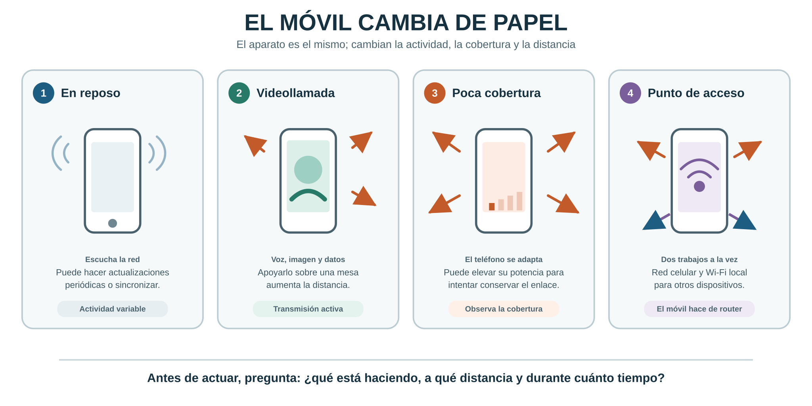

> **FIGURA 3.1 · El móvil cambia de papel.** Cuatro escenas: en reposo, videollamada, poca cobertura, punto de acceso. Pie: "Antes de actuar pregunta: ¿qué está haciendo, a qué distancia y durante cuánto tiempo?". Referencia Codex: `el-movil-cambia-de-papel`.

Cuatro escenas: espera sobre una mesa; videollamada a un palmo; envío de un vídeo con poca cobertura; punto de acceso para el ordenador. En la última mantiene la conexión con la antena y crea un Wi-Fi: se ha convertido en un pequeño router.

Una decisión para cada escena: aparta el móvil mientras descarga, usa el altavoz cuando sea práctico, espera a tener mejor cobertura si la llamada puede esperar y apaga el punto de acceso al terminar.

## Una llamada con más distancia

Para separar el aparato de la cabeza tienes tres opciones: altavoz, auriculares con cable y auriculares de tubo de aire. En estos últimos, el último tramo lleva el sonido por un tubo hueco, sin electrónica junto al oído.

Los auriculares inalámbricos usan Bluetooth, que es otra emisión de radiofrecuencia pegada a la cabeza durante horas. En EKIO no los recomendamos: cable o tubo de aire, siempre. Y el móvil, sobre una superficie, no en el bolsillo.

## El router que añadimos dentro de casa

Si solo usas el móvil y tienes buena cobertura, apagar el router elimina su Wi-Fi. Pero el móvil sigue hablando con la antena de la calle; no se limita a recibir.

Si luego activas "Compartir Internet", vuelves a crear una red en casa. Y si la cobertura es mala, el móvil sube su potencia. Por eso quitar el router no garantiza menos exposición total en todas las situaciones.

Con varias personas en casa suele ser más práctico mantener la conexión fija, cablear lo que no se mueve y apagar el Wi-Fi cuando nadie lo usa. Elige la conexión por su uso, su cobertura y su sitio.

## Receta 1 — Haz una auditoría de conexiones en dos minutos

**Necesitas:** tu móvil. **Resultado:** cada conexión activa tiene una función.

1. **Abre los ajustes.** Datos, Wi-Fi, Bluetooth y punto de acceso. El icono del avión no basta: en algunos modelos el Wi-Fi o el Bluetooth se reactivan solos.
2. **Apaga lo que no usas.** Comprueba reloj, auriculares y conexiones compartidas antes de cortar algo que necesites.
3. **Organiza las tareas grandes.** Copias de seguridad y subidas de vídeo, en un momento concreto y con el móvil lejos del cuerpo.
4. **Cierra "Compartir Internet"** en cuanto termines con el portátil.
5. **Dale un sitio de descanso.** Sobre la mesa mientras trabajas; en su punto de carga, fuera del dormitorio, por la noche.

## SPIRO: quién lo hizo y por qué lo uso

Cuando empecé a trabajar con personas con sensibilidad química y electrohipersensibilidad, vi que el teléfono era también su herramienta de trabajo, de contacto y de ayuda. Quitárselo no era una solución. Necesitaba algo que encajara en su vida.

SPIRO es una tecnología desarrollada por Joaquín Machado y su empresa, Noxtak. Es un material nanocompuesto pasivo, sin pilas ni cables, en forma de tarjeta, cuadrado o disco. Según su fabricante, actúa sobre la forma en que se ordenan los campos artificiales de nuestro alrededor (la "polarización" de la que hablamos en el capítulo 1) sin cortar ni atenuar las comunicaciones. Ha recibido reconocimientos internacionales de innovación, entre ellos el Edison Award de 2020, el Silicon Valley Invention Festival de 2019 y el German Innovation Award de 2021.

En EKIO lo distribuimos desde hace años y lo hemos incorporado a cientos de hogares. Lo que cuento en este capítulo sale de esa experiencia y de la documentación técnica del fabricante.

Y te digo también lo que no tiene todavía: los ensayos clínicos grandes e independientes que tienen los medicamentos. Nadie los ha pagado. Tiene su base técnica, sus premios, ensayos de laboratorio encargados por el fabricante y quince años de casas revisadas. Yo te cuento lo que hacemos y por qué, y tú decides.

Primero resuelvo lo evitable: aparatos innecesarios, proximidad y problemas de instalación. Todo lo gratuito de este libro funciona igual sin SPIRO. Después te explico cómo lo incorporamos.

## Un SPIRO para cada situación

| Situación | Lo que hacemos en EKIO |
|---|---|
| Teléfono o tableta | SPIRO Card en la parte de atrás, entre el aparato y la funda |
| Router | SPIRO Disc delante del router |
| Ordenador, tableta o asistente de voz | SPIRO Square junto al aparato |
| Estancia con varias fuentes | El modelo Disc adecuado para el espacio |
| Viajes, transporte y puestos de trabajo ajenos | Square X, que cabe en un bolsillo o una bolsa |
| Inversor solar, coche eléctrico | Disc X |
| Zonas urbanas muy densas o personas que refieren alta sensibilidad | Disc X o Disc Ultra, según la valoración del lugar |
| Ruido medido en la línea eléctrica | Stroom Master, un filtro que se enchufa |

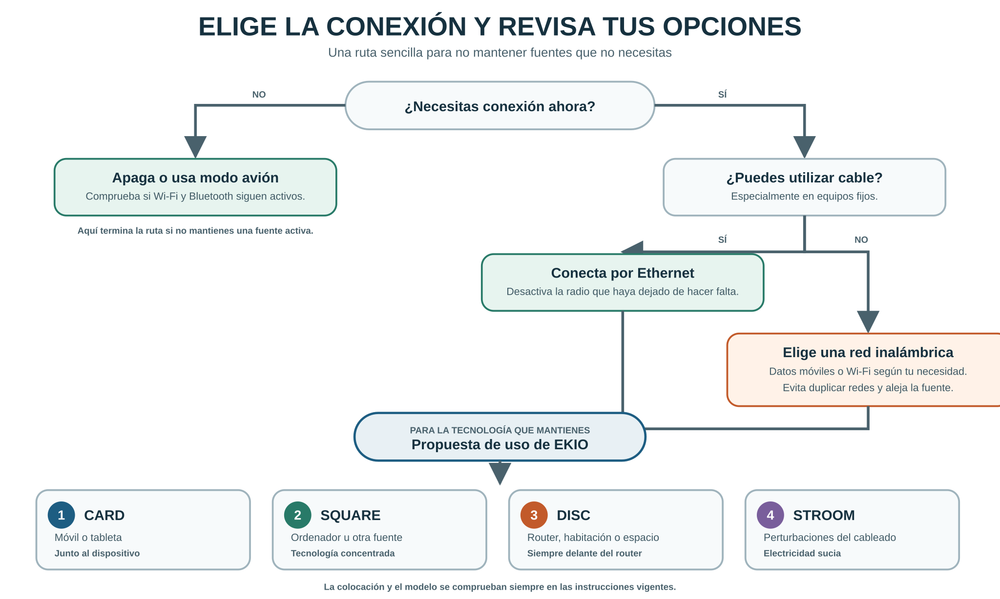

> **FIGURA 3.2 · Elige la conexión y revisa tus opciones.** Árbol de decisión: ¿necesitas conexión ahora? No: apaga o modo avión. Sí: ¿puedes usar cable? Sí: Ethernet. No: elige una red y aleja la fuente. Debajo, los cuatro formatos: Card (móvil), Square (equipo), Disc (espacio, delante del router), Stroom Master (línea). Referencia Codex: `ruta-conexion-y-spiro`, con "Stroom Master" completo.

### Por qué el Disc va delante del router

Vas a leer "el Disc delante del router" varias veces en este libro. Te explico ahora el motivo para no repetirlo después.

El router es, en la mayoría de las casas, la fuente de radiofrecuencia que más horas está encendida. El fabricante de SPIRO indica colocar el Disc junto a la fuente principal de cada estancia. Y es lo que hacemos en cada vivienda que revisamos desde que trabajamos con SPIRO, porque es lo que mejor nos ha funcionado y lo que nuestros clientes nos refieren.

No es una medida que puedas comprobar con un medidor corriente: el Disc no baja la lectura. Y no sustituye a mover el router fuera del dormitorio, cablear lo fijo o apagar el Wi-Fi de noche. Es lo que añadimos después de todo eso.

## Receta 2 — Prepara correctamente tu móvil con SPIRO

**Necesitas:** teléfono, funda, Card y sus instrucciones. **Resultado:** la tarjeta colocada sin molestar al móvil.

1. **Comprueba el modelo.** Card, Card X y Square son formatos distintos. Lee el nombre completo.
2. **Coloca la tarjeta.** Detrás del teléfono, entre el aparato y la funda. La funda debe cerrar sin forzar.
3. **Revisa accesorios.** Compatibilidad con carga inalámbrica, soportes magnéticos y calor.
4. **Conserva tus hábitos.** Altavoz o cable, descargas con el móvil apartado y carga fuera de la cama.
5. **Comprueba al cambiar de funda.** Una vez bien puesta, no hace falta vigilarla.

## El teléfono frente a una cabeza de laboratorio

Imagina un maniquí lleno de un líquido que imita las propiedades eléctricas de los tejidos. Una sonda mide cuánta energía de radiofrecuencia absorbe: es la SAR, tasa de absorción específica. El límite europeo es de 2 vatios por kilo, promediado en diez gramos de tejido.

En 2015, Noxtak encargó a un laboratorio de Shenzhen, MORLAB, un ensayo de SAR de un teléfono con y sin SPIRO Card, en seis configuraciones. Los valores con tarjeta fueron menores en todas. Por ejemplo, en la red 3G junto a la cabeza, de 0,604 a 0,057 vatios por kilo; en la red 2G junto al cuerpo, de 0,945 a 0,118.

Es una reducción muy grande para una lámina pasiva, y es un ensayo del fabricante con un teléfono de 2015 que nadie ha repetido de forma independiente. Por eso lo cito como dato técnico del fabricante, no como prueba de salud: el informe no mide sueño, síntomas ni enfermedades. Está enlazado en la bibliografía para que lo leas tú.

## Qué puede comprobar un medidor

Un medidor de radiofrecuencia te permite comparar el router encendido y apagado en el mismo punto. No mide la orientación de la señal, que es sobre lo que dice actuar SPIRO.

Por eso te lo digo claro: el Disc no cambia la lectura del medidor. Si alguien te lo vende así, desconfía. Lo que hace, según su fabricante, es otra cosa, y se comprueba de otra manera.

## Receta 3 — Decide qué hacer con el router

**Necesitas:** el inventario de lo que se conecta en casa. **Resultado:** conexión suficiente y fuentes bien situadas.

1. **Haz el inventario.** Ordenadores, televisión, domótica, alarmas, teleasistencia. ¿Quién necesita conexión de noche?
2. **Revisa la alarma con su instalador.** Algunas van por cable, otras por tarjeta SIM, otras por Wi-Fi. La SIM también usa radiofrecuencia. Comprueba respaldo y avisos antes de apagar nada.
3. **Elige tu configuración.** Sin router, comprueba cobertura y servicios. Con router, cablea lo fijo y programa el Wi-Fi solo si no cortas nada necesario.
4. **Sitúalo fuera de la zona de permanencia.** Ni cabecero, ni respaldo del sofá, ni bajo los pies. Si usas SPIRO, el Disc delante. El test de la web te orienta sobre el modelo.
5. **Prueba el conjunto.** Conexión, alarma y servicios. Busca redes de invitados o repetidores que sigan activos.

## El coche eléctrico también es una habitación

Sales de casa y entras en otro espacio cerrado con electrónica. Muchos coches eléctricos llevan la batería bajo el suelo, uno o varios motores, inversores y cables de potencia. Al acelerar, al frenar y al cargar cambian las corrientes. Y dentro siguen el móvil, el Wi-Fi y el Bluetooth.

El Centro Común de Investigación de la Comisión Europea midió en 2020 nueve vehículos eléctricos e híbridos. El campo magnético variaba entre modelos y situaciones, con picos cerca de los pies en algunas maniobras. La lección: compara posiciones y estados, no interpretes una lectura como si fuera todo el viaje.

En 2025, Joaquín Machado, el creador de SPIRO, publicó una exploración de dos Tesla Model Y con 952 registros de campo, antes y después de instalar un disco SPIRO en la cabina. Fue un trabajo exploratorio, sin ocupantes ni resultados de salud. Lo cito porque existe y porque es del inventor de la tecnología, no porque pruebe nada más.

Si conduces muchas horas (taxi, reparto) y notas dolor de cabeza o malestar, revisa jornada, postura, ventilación y descanso además del vehículo. Esos síntomas merecen atención; no permiten culpar a la batería.

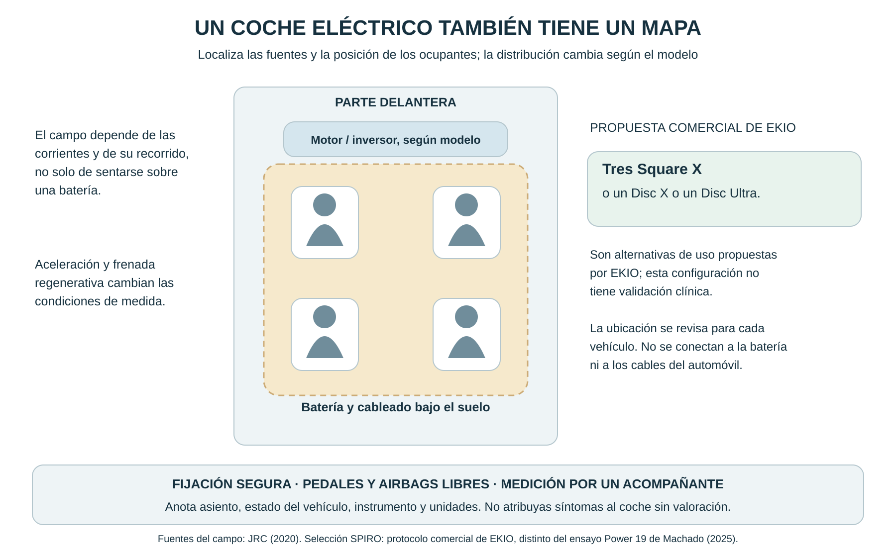

> **FIGURA 3.3 · Un coche eléctrico también tiene un mapa.** Planta reconocible de un coche (ruedas, parabrisas) con motor e inversor delante, batería bajo los asientos, cuatro ocupantes. A un lado: "Propuesta de EKIO: tres Square X, o un Disc X". Pie: "Fijación segura · pedales y airbags libres · mide un acompañante, no el conductor". Referencia Codex: `mapa-coche-electrico-spiro`, rehecho para que parezca un coche.

## Receta 4 — Revisa un coche eléctrico

**Necesitas:** un acompañante si vas a medir. **Resultado:** saber qué cambia y dónde.

1. **Compara situaciones.** Reposo, circulación, aceleración, frenada y carga. Pies, asientos, consola y plazas traseras. Durante la marcha mide el acompañante: el conductor conduce.
2. **Apaga conexiones que sobran.** Conserva las de seguridad. Aparta el móvil del cuerpo.
3. **Cuida la jornada.** Ventila, para, cambia de postura. Si hay síntomas persistentes, pide valoración.
4. **Si incorporas SPIRO**, en EKIO proponemos tres Square X repartidos o un Disc X, según el caso. Fíjalos sin tocar pedales, airbags ni visibilidad, y nunca conectados a la batería.
5. **Anota las condiciones.** Ruta, velocidad, cobertura y carga cambian las lecturas.

## Devuelve al teléfono su sitio

Martin Cooper llevó la llamada a la calle. Tú decides hasta dónde la dejas entrar.

Antes de seguir, elige el aparcamiento nocturno de los móviles de tu casa y apaga una conexión que ya haya terminado su trabajo. Una decisión concreta vale más que vigilar iconos todo el día.

**En una frase:** el móvil no es malo; lo que es malo es no saber nunca qué está haciendo, a qué distancia lo tienes y dónde duerme.
# Capítulo 4 · Volver a salir fuera

Suena el despertador. Enciendes el techo, miras el móvil y sales por el garaje. Trabajas bajo luz artificial, comes dentro y vuelves cuando ya es de noche. Entonces enciendes otra vez el techo.

Has visto la hora cien veces. Tu cuerpo, en cambio, apenas ha recibido señales del día real.

En este capítulo vamos a recuperar tres: la luz del exterior, la transición hacia la noche y el contacto con la tierra. Podemos empezar abriendo una puerta.

## La planta que siguió dando la hora

En 1729, el astrónomo francés Jean-Jacques d'Ortous de Mairan metió una planta de hojas móviles en un armario oscuro. Las hojas siguieron abriéndose de día y cerrándose de noche. El movimiento no dependía de que alguien encendiera el sol.

Tu cuerpo también lleva ritmos dentro: sueño, temperatura, actividad. La luz que entra por los ojos ajusta ese reloj al día exterior, como pones en hora un reloj de pulsera que se ha desfasado.

Para recibir esa señal basta mirar el entorno. No mires directamente al Sol.

## Una habitación luminosa se queda corta

Una lámpara te permite leer y, aun así, da muchísima menos luz que la calle. Puede que tu salón bien iluminado tenga cien veces menos luz que un día nublado.

En 2013, Kenneth Wright y su equipo se llevaron a ocho adultos una semana de acampada, con luz natural de día y oscuridad de noche, sin electricidad. Su reloj interno, medido por la melatonina, se alineó con el sol. Fue una semana entera de condiciones, no una salida de tres minutos.

La acción doméstica es sencilla: acerca tus actividades a la luz del día y añade salidas que puedas repetir. Trabajar junto a una ventana ayuda; caminar fuera cambia además la intensidad, la distancia a la que miras y el movimiento.

> **FIGURA 4.1 · El reloj diario de luz, tierra y tecnología.** Franja del día de noche a noche, con cuatro tarjetas: antes del amanecer (empieza suave), primera luz (encuentra el cielo), día (sal, muévete, pisa tierra), anochecer (baja la señal de día). Referencia Codex: `reloj-natural-diario`, unificando con la figura 2.2.

## Amanecer y anochecer: dos señales distintas

El comienzo del día y la llegada de la oscuridad ayudan a poner el reloj en hora. El efecto de la luz depende de cuándo la recibes, de su intensidad, de su color y de cuánto dura.

En el año 2000, Konstantin Danilenko y sus colaboradores simularon amaneceres en el dormitorio de voluntarios. Un amanecer artificial adelantó el inicio de la melatonina unos veinte minutos; tres amaneceres, unos treinta y cuatro. Es una muestra de lo rápido que responde el reloj, no una receta.

Sal durante la primera parte de tu mañana y busca también una transición tranquila al anochecer. Si trabajas de noche, tu luz y tu sueño necesitan otro horario; el amanecer no siempre es la señal que te conviene justo antes de acostarte.

### La melatonina tiene más de una función

La melatonina que produce la glándula pineal sigue un ritmo nocturno y la luz de noche la frena. Pero también se produce melatonina en otros tejidos, con funciones locales, y se estudia dentro de las mitocondrias, las centrales de energía de la célula.

Una revisión de 2023 propone que el infrarrojo cercano, esa parte de la luz del sol que sentimos como calor, podría participar en esa producción local. Es una línea de investigación, no una prueba de que mirar el amanecer suba tu melatonina en una cantidad concreta.

Lo que haces tú: reforzar la diferencia entre día y noche. Luz exterior mientras estás activo, transición al anochecer y oscuridad para dormir.

## Una mañana que cabe en tu vida

Une la salida a algo que ya haces: sacar al perro, llevar a los niños, tomar el café en una terraza, ir a por el pan. Un cielo nublado sigue siendo exterior.

Si te levantas antes del amanecer, usa una luz suave que te deje moverte con seguridad: la amarilla de 1800 K o la roja DUSK. Después busca el día. La bombilla no sustituye al cielo.

Durante la jornada, aprovecha una pausa, una comida o una llamada para salir. Busca sombra, ropa y protección según la estación, el índice UV y tu piel. Si tienes una enfermedad ocular o cutánea, o tomas medicación que te sensibiliza a la luz, adapta la exposición con quien conoce tu caso.

La luz exterior también llega a la sombra. El objetivo del paseo es volver con ganas de repetirlo.

## Cuando el reloj llega a la célula

El tiempo biológico también entra en el metabolismo. En 2009, Yasukazu Nakahata y su equipo describieron en el laboratorio cómo las proteínas del reloj celular regulan la producción de una molécula necesaria para la energía, el NAD+. Es decir: tu reloj no solo decide cuándo tienes sueño, también cuándo tus células fabrican energía.

Este es uno de los enlaces que me interesa reunir bajo electrobiofotónica: bioelectricidad, luz y organización de la vida. El concepto relaciona preguntas; cada respuesta necesita sus propias pruebas.

## Grounding: tocar la Tierra

Te quitas los zapatos sobre arena o césped. Bajo los pies vuelve un contacto que las suelas de goma interrumpen todo el día.

El grounding es el contacto conductor entre tu cuerpo y la Tierra. Cambia la tensión eléctrica de tu cuerpo respecto al suelo: un estudio de 2016 midió esa tensión en cincuenta personas y vio que bajaba mucho al conectarse a tierra. Eso no apaga las fuentes del entorno ni te protege de la radiofrecuencia. Es otra cosa.

Algunos estudios pequeños han explorado efectos sobre el sueño, el cortisol o el ritmo cardíaco: doce personas en 2004, veintiocho en 2010, en trabajos de investigadores vinculados al movimiento del grounding. Su tamaño limita lo que se puede concluir.

Yo lo incluyo como lo que es: un contacto natural que acompaña al paseo y al descanso fuera. Si te resulta agradable y es seguro, hazlo. No hace falta atribuirle todos los efectos de estar al aire libre.

> **FIGURA 4.2 · Qué cambia al tocar tierra.** Dos figuras humanas junto a un cable con tensión: una sobre suela aislante (puede aparecer tensión inducida en el cuerpo), otra descalza sobre hierba (esa tensión baja). Arriba, un router: "la radiofrecuencia sigue presente en los dos casos". Pie: "Menos tensión respecto a tierra no es protección sanitaria; el grounding no sustituye la revisión eléctrica". Referencia Codex: `grounding-paraguas-natural`, sin que las curvas tapen el texto.

Una toma de tierra de seguridad es parte de la instalación eléctrica; el grounding corporal es otra práctica. No improvises cables hacia enchufes, tuberías ni estructuras metálicas. Un sistema para interior necesita instalación comprobada, producto diseñado para eso y sus instrucciones.

## Receta 1 — Una mañana que el cuerpo pueda reconocer

**Necesitas:** cinco minutos al levantarte. **Resultado:** una salida unida a tu rutina.

1. **Si aún es de noche, ilumina solo lo necesario.** Luz suave, suficiente para ver escalones.
2. **Cuando haya luz, sal.** Cinco o diez minutos sirven para crear el hábito. Mira el entorno, nunca el Sol.
3. **Aparta la pantalla.** Camina o siéntate fuera sin pasar la salida mirando el móvil.
4. **Anota la rutina una semana.** Hora de salida, hora de acostarte y cómo descansas. Para ajustar, no para diagnosticar.

## Receta 2 — Grounding sin montar un laboratorio

**Necesitas:** un trozo de tierra, césped o arena. **Resultado:** probar un contacto natural cómodo y seguro.

1. **Elige suelo seguro.** Sin cristales, sin contaminación, sin temperaturas extremas. Si tienes pérdida de sensibilidad en los pies, heridas o problemas de circulación, no camines descalzo sin consultar.
2. **Ponte cómodo.** Sentado, caminando o con las manos en la tierra del jardín. No aguantes molestias para cumplir un tiempo.
3. **Mira el conjunto.** Luz, movimiento, descanso y contacto ocurren a la vez. Si te encuentras mejor, no sabrás cuál fue.
4. **Para interior, un sistema adecuado.** Con instalación confirmada e instrucciones. Nunca una conexión casera.

## Receta 3 — Devolver el anochecer a la casa

En 2015, Anne-Marie Chang y sus colaboradores pusieron a doce adultos a leer cuatro horas antes de dormir, cinco noches seguidas: unas noches en una pantalla luminosa, otras en papel. Con la pantalla, la melatonina se retrasó, tardaron más en dormirse y estaban menos despiertos a la mañana siguiente. Eran condiciones intensas, pero la lección sirve para cualquier casa: las últimas horas del día no son horas de pantalla.

**Necesitas:** las dos bombillas y una hora de cierre. **Resultado:** una noche que empieza antes de meterte en la cama.

1. **Al anochecer, baja la intensidad.** Entra la amarilla de 1800 K como luz de ambiente.
2. **Al acercarse el descanso, cierra las pantallas.** Luz tenue para lo necesario; la roja DUSK es otra opción. El color no compensa una intensidad excesiva.
3. **Para dormir, apaga.** Si necesitas una luz de paso, la mínima útil y fuera de los ojos. Que el recorrido se vea para no caerte.
4. **Los paneles, para su uso.** Una sesión de luz tiene parámetros y objetivo. En el capítulo siguiente aprenderás a leerlos.

## Antes de volver dentro

Elige un cambio para mañana: un paseo al levantarte o una hora de cierre de pantallas. Organiza primero ese momento. La regularidad es lo que convierte una idea del libro en parte de tu casa.

**En una frase:** tu cuerpo espera cada día tres cosas que ya no le das: el cielo por la mañana, la oscuridad por la noche y la tierra bajo los pies.
# Capítulo 5 · Usar la luz en casa

En 1903, un médico danés recibió el Premio Nobel por tratar una enfermedad con luz. Se llamaba Niels Ryberg Finsen y trabajaba con el lupus vulgaris, una tuberculosis de la piel. No tenía LED, ni una aplicación, ni un panel colgado de la puerta. Tenía filtros, lentes, lámparas difíciles de manejar y una idea poderosa: la luz podía ser una intervención biológica.

Aquella fototerapia no era la fotobiomodulación de hoy. Pero abrió una puerta: dejó de mirar la luz solo como iluminación y empezó a estudiarla como algo que se puede dosificar.

Hoy llamamos **fotobiomodulación** a aplicar luz, normalmente roja e infrarroja cercana, para modificar procesos biológicos sin calentar el tejido. Sus resultados dependen de cómo se aplica.

Ahora imagina que desembalas tu primer panel. Tiene varios botones y un temporizador. La tentación es sencilla: encenderlo todo y acercarte mucho para aprovecharlo mejor.

Antes de pulsar, vamos a resolver cinco decisiones: qué luz emite, cuánta llega, durante cuánto tiempo, sobre qué zona y para qué.

## Dos luces que no debemos confundir

Las bombillas amarilla de 1800 K y roja DUSK sirven para iluminar el ambiente. Las usas con poca intensidad antes de amanecer y al final del día. Importa el color, pero también el brillo, la duración y cuánta luz llega a los ojos.

Un panel de fotobiomodulación tiene otra misión. Lo enciendes para hacer una sesión, eliges una zona, respetas una distancia y un tiempo, y lo apagas al terminar.

Piensa en la diferencia entre la luz del comedor y una ducha. La lámpara crea un ambiente para toda la estancia. En la ducha pones el cuerpo en un sitio concreto, regulas el caudal y te quedas un rato. Nadie deja la ducha abierta toda la noche porque el agua sea buena.

Con la luz pasa lo mismo.

| Iluminación ambiental | Fotobiomodulación |
|---|---|
| Organiza el ambiente y la hora del día | Aplica luz a una zona con un objetivo |
| Importan color, intensidad, parpadeo y horario | Importan longitud de onda, potencia, dosis, distancia y tiempo |
| Bombillas amarillas o rojas | Un panel y uno o varios modos |
| Se mantiene mientras haga falta iluminar | Se apaga cuando termina la sesión |

## El nanómetro: la dirección de la luz

Una longitud de onda se expresa en nanómetros, nm. No necesitas imaginar algo tan pequeño. Solo leer el número como una dirección dentro del espectro.

Alrededor de 630 o 660 nm vemos rojo. En 810, 850 o 940 nm estamos en el infrarrojo cercano: no lo vemos, pero el panel sigue emitiendo. Y ojo con eso: como no lo ves, no parpadeas ni cierras los ojos por reflejo. Por eso la protección ocular que indique el fabricante no es opcional. En torno a 485 nm vemos una luz azul verdosa, cian. Más allá del violeta está el ultravioleta, con efectos y precauciones distintas.

La longitud de onda influye en qué moléculas absorben la luz y hasta dónde llega en el tejido. Pero no es una dirección postal: "850 nm va a la articulación" o "1050 nm llega al hueso" son frases de catálogo. Lo que llega depende de la piel, el tejido, la pigmentación, la potencia, el haz, el ángulo y la distancia.

Los nanómetros dicen qué luz usas. Falta saber cuánta llega.

## Irradiancia: el caudal

La irradiancia es la potencia de luz que recibe una superficie. En los paneles se expresa en milivatios por centímetro cuadrado, mW/cm².

Es el caudal de la ducha. A la misma distancia, un panel da más o menos caudal. Si te alejas, la luz se reparte sobre más zona y la irradiancia baja. Por eso una cifra sin distancia está incompleta.

La potencia eléctrica del aparato, en vatios, tampoco es lo que llega a tu piel. Parte se va en electrónica y calor. Un panel de muchos vatios no entrega necesariamente la misma luz en cada centímetro.

## Tiempo y dosis: lo que de verdad recibe la zona

La dosis, o fluencia, se expresa en julios por centímetro cuadrado, J/cm². Se calcula multiplicando la irradiancia por el tiempo:

Dosis (J/cm²) = irradiancia (W/cm²) × tiempo (segundos)

Un ejemplo con números inventados para que la cuenta sea fácil: si a la distancia de uso llegan 20 mW/cm², eso son 0,02 W/cm². Cinco minutos son 300 segundos. 0,02 × 300 = 6 J/cm².

El ejemplo enseña a calcular; no te dice qué dosis necesitas tú. Eso lo dice la guía de tu modelo. Y si el panel funciona en modo pulsado (se enciende y apaga muy rápido), hace falta saber la irradiancia media. Copiar los minutos de otro panel es como copiar el tiempo de una receta y cambiar el horno de 160 a 250 grados.

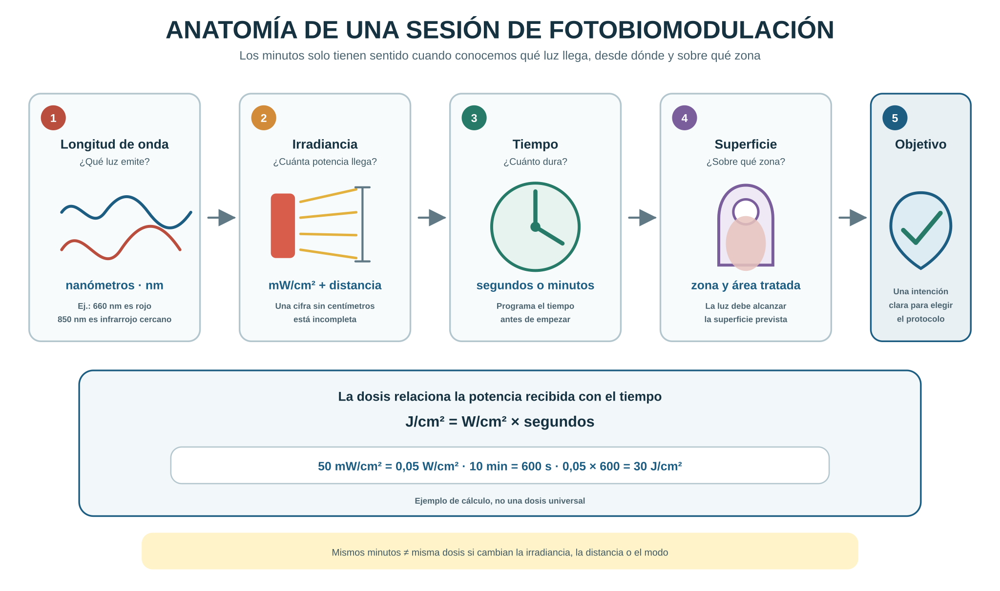

> **FIGURA 5.1 · Anatomía de una sesión de fotobiomodulación.** Cinco tarjetas: longitud de onda (¿qué luz?), irradiancia (¿cuánta llega y desde dónde?), tiempo, superficie, objetivo. Debajo, la fórmula y el ejemplo con números inventados. Pie: "Mismos minutos no es misma dosis si cambian la potencia, la distancia o el modo". Referencia Codex: `anatomia-sesion-pbm`, con el nuevo ejemplo.

## Qué hace la luz cuando llega al tejido

Algunas moléculas absorben la luz y ponen en marcha cambios en el metabolismo y en la comunicación entre células. La mitocondria, la central de energía de la célula, participa en muchas de las respuestas estudiadas. Pero llamarla "batería que se carga con luz" es simplificar demasiado.

En 2017, un equipo comparó distintos colores sobre células madre humanas en cultivo: el rojo de 660 nm y el infrarrojo de 810 nm favorecieron que se multiplicaran; el azul y el verde, no. Era un experimento con células, no una prueba de que cada color regenere un órgano.

El mecanismo exacto se sigue afinando. En 2021, dos investigadores no encontraron el aumento de consumo de oxígeno que se esperaba al iluminar la enzima mitocondrial más citada. Por eso conviene hablar de varios mecanismos posibles y no de un interruptor universal.

*[Figura 5.2 · Qué hace la luz en el tejido — figura nueva, pendiente de Mauro Arroyo]*

> **FIGURA 5.2 · Qué hace la luz en el tejido.** Corte de piel con la luz entrando; una célula con su mitocondria; flechas "luz → moléculas que la absorben → cambios en la energía y la señalización". Rótulo: "Varios mecanismos en estudio, no un interruptor". Figura nueva.

La consecuencia práctica es sencilla: elige el modo para tu objetivo y respeta la dosis. Añadir colores no garantiza ventaja.

## Más luz no siempre ayuda más

Si una planta necesita agua, un vaso la ayuda. Cien litros en cinco minutos no la ayudan cien veces más.

En fotobiomodulación se han visto respuestas en forma de campana: un efecto aparece en ciertas condiciones y se reduce o cambia si te pasas. No hay una dosis única para todo. Si doblas los minutos porque la sesión anterior te gustó, has cambiado la intervención.

## Dos estudios que ayudan a elegir con criterio

### La piel: una mejora medida tras treinta sesiones

En 2014, Alexander Wunsch y Karsten Matuschka publicaron un estudio con 136 voluntarios. Comparaban grupos tratados dos veces por semana con luz roja, o con un espectro más amplio, frente a un grupo sin tratamiento. Tras treinta sesiones, los tratados tenían menos rugosidad y más colágeno. El espectro amplio no fue mejor que el rojo solo.

Dos lecciones. Una para estudiar: hay una razón para investigar esta aplicación. Otra para comprar: más longitudes de onda no aseguran más resultado. Y un matiz: el grupo de control no recibió una luz placebo, y los equipos los puso el fabricante. No fue cualquier panel doméstico.

### La recuperación muscular: importa también cómo se aplica

En 2016, un equipo brasileño estudió a cincuenta hombres tras un ejercicio que exige al músculo mientras se alarga. Compararon luz, frío, combinaciones y placebo. La luz salió favorable en las medidas de recuperación.

Usaron un equipo concreto, mezcla de láser y LED, sobre puntos del muslo. Lo útil para ti: pide un protocolo compatible con tu dispositivo y tu objetivo, no copies los minutos de un titular.

## La familia EKIO Light, sin cifras que caduquen

Creé EKIO Light con una idea: si vamos a usar luz para cuidarnos, el aparato tiene que encajar en una buena higiene electromagnética. Por eso miramos el espectro, el parpadeo, la fuente de alimentación y los campos alrededor del panel.

Te presento la familia como familia, sin números de irradiancia ni recuentos de LED, porque los modelos cambian y un libro no. Los datos exactos de tu equipo están en su ficha, en la web y en la app. El test "Qué EKIO Light necesito" te ayuda a ordenar las opciones.

- **Core.** El pequeño. Trece LED de rojo e infrarrojo en un chasis que cabe en la mano, pensado para trabajar una zona en contacto o muy cerca. Es la entrada a la familia y el que más gente tiene en casa. Y por eso te doy aquí su única regla importante: en contacto, la luz llega concentrada y las sesiones son cortas. Su temporizador llega lejos porque también sirve a distancia; no lo apures pegado a la piel.
- **Deep 5.** El panel de rojo e infrarrojo con cinco longitudes de onda y modos separados. Para sesiones sobre zonas más amplias, a la distancia que indique su guía.
- **Bio Regén 7.** Añade un cian y un infrarrojo más profundo, y un módulo central para concentrar la luz sobre una zona. El cian se relaciona con la sensibilidad de la retina para el reloj del día; eso no convierte el panel en una lámpara para mirar. No mires sus LED. Para la señal de día, la primera opción de esta guía sigue siendo salir.
- **Bio Spectrum 11.** El más amplio: cuatro circuitos que van del ultravioleta al infrarrojo. Su bloque de ultravioleta, violeta y cian se enciende junto. Ese bloque queda fuera de todas las recetas domésticas de este libro: la fototerapia ultravioleta requiere valoración profesional porque puede dañar piel y ojos. Para una sesión roja o infrarroja, comprueba que ese circuito está apagado.

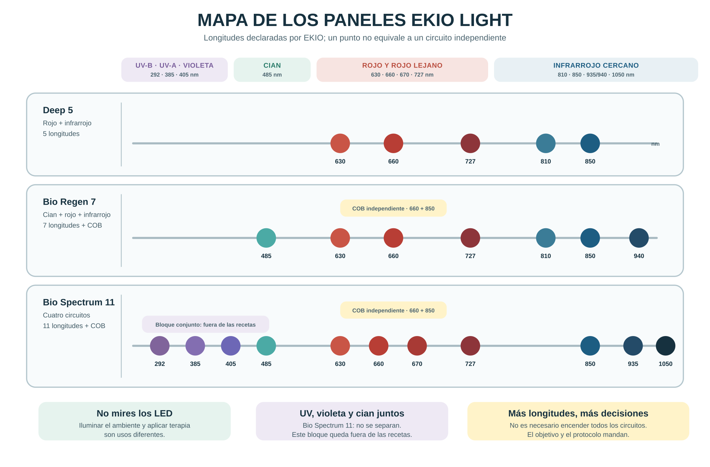

> **FIGURA 5.3 · La familia EKIO Light.** Cuatro siluetas de menor a mayor (Core, Deep 5, Bio Regén 7, Bio Spectrum 11) sobre tres franjas de color: rojo, infrarrojo, cian; el Bio Spectrum añade una franja ultravioleta marcada "fuera de las recetas domésticas". Sin cifras. Pie: "Los datos de cada modelo, en su ficha vigente". Referencia Codex: `mapa-paneles-ekio-light`, simplificado.

Antes de comprar, pregunta qué circuitos puedes encender por separado. Ese dato vale más que el número total de longitudes de onda.

## Receta 1 — Lee tu panel antes de encenderlo

**Necesitas:** la ficha de tu modelo y un papel. **Resultado:** cinco decisiones escritas.

1. **Elige el objetivo.** Una frase: "quiero la sesión indicada para la piel", "quiero acompañar mi recuperación", "quiero trabajar una zona". Un objetivo por sesión evita pulsar botones al azar.
2. **Identifica modelo y modo.** Core, Deep 5, Bio Regén 7 o Bio Spectrum 11. Localiza qué circuito indica la guía actual para tu objetivo.
3. **Busca distancia, tiempo y frecuencia.** Los tres juntos. Diez minutos a quince centímetros no son diez minutos a treinta.
4. **Revisa ojos, piel y medicación.** Protección ocular del modo. Nada de ultravioleta fuera de su protocolo. Si tomas medicación que te sensibiliza a la luz, tienes una lesión sin diagnosticar, un tumor conocido o sospechoso en la zona, estás embarazada o en tratamiento, consulta antes. Si el panel tiene modo pulsado y tienes epilepsia fotosensible, no lo uses sin consejo médico. Cerrar los ojos no sustituye la protección.
5. **Prepara un registro.** Zona, modo, distancia, minutos y qué quieres observar, con una escala de 0 a 10. Es un registro personal, no una prueba de eficacia.

## Receta 2 — Prepara una sesión local

**Necesitas:** el panel, un soporte estable y su temporizador. **Resultado:** una sesión con los mismos parámetros cada vez.

1. **Coloca el panel de forma estable.** No lo sostengas toda la sesión ni improvises apoyos que puedan caer.
2. **Descubre la zona.** La ropa cambia la luz que llega. Retira productos que el manual desaconseje.
3. **Mide la distancia.** Desde la superficie que emite hasta la zona tratada. Siempre desde el mismo punto.
4. **Selecciona el modo.** Solo los circuitos indicados. Si hay pulso o intensidad variable, el ajuste del protocolo.
5. **Programa el tiempo antes de empezar.** Con el temporizador del panel, y el móvil lejos.
6. **Observa la respuesta.** Una sensación templada puede aparecer. Dolor, irritación en los ojos, mareo o reacción en la piel son motivos para parar.
7. **Apaga al terminar.** Anota la sesión y vuelve a la luz de ambiente que toque por la hora.

## Receta 3 — Organiza la luz de toda la casa

**Necesitas:** las dos bombillas y una lámpara que uses de noche. **Resultado:** una casa que cambia de luz con el día.

- **Al despertar antes del amanecer:** luz tenue que te deje moverte, amarilla o roja. Cuando haya luz fuera, abre las persianas y sal un rato.
- **Durante el día:** luz suficiente para leer, trabajar y jugar. Mantener la casa en penumbra todo el día no es el objetivo.
- **Al anochecer:** baja la general y usa luz local amarilla de 1800 K. La roja DUSK, para los últimos momentos o para un pasillo. No hace falta cambiar todas las bombillas de golpe.
- **Al acostarte:** apaga lo que no necesitas. Si alguien requiere una luz de orientación, tenue, baja y fuera de la línea de visión.

Tu tarea de hoy: elige una lámpara que uses de noche y decide qué cambiarás: su intensidad, su sitio o la hora a la que la apagas.

## La ficha que debe acompañar siempre a un panel

Cuando valores cualquier equipo, de cualquier marca, busca estos datos:

| Dato | Pregunta que resuelve |
|---|---|
| Longitudes de onda | ¿Qué regiones del espectro usa? |
| Irradiancia y distancia | ¿Cuánta potencia llega y desde dónde se midió? |
| Mapa de uniformidad | ¿La luz se reparte igual en el centro y en los bordes? |
| Modos y circuitos | ¿Qué puedo encender por separado? |
| Pulso y ciclo de trabajo | ¿La emisión es continua o intermitente? |
| Parpadeo | ¿Cómo se comporta la luz en el tiempo? |
| Campos eléctrico y magnético | ¿Qué se midió, con qué instrumento y a qué distancia? |
| Protección ocular y contraindicaciones | ¿Cómo uso cada modo con seguridad? |

Si un dato necesario no aparece, pídelo antes de improvisar. En EKIO puedes pedir ayuda para identificar tu modelo y su guía.

Antes de tu próxima sesión deja escritos los cinco datos: objetivo, modo, distancia, tiempo y frecuencia. Con esa pequeña ficha ya estás tomando una decisión más útil que encender todos los botones.

**En una frase:** las bombillas son para vivir y los paneles para una sesión; el error más común es tratar a un panel como si fuera una lámpara y a una lámpara como si fuera un tratamiento.
# Capítulo 6 · Niños y adolescentes

El 9 de enero de 2007, Steve Jobs presentó el primer iPhone. Un niño nacido aquel año ya es adulto. Hemos aprendido a convivir con esta pantalla mientras nuestros hijos crecían con ella.

Imagina que tu hijo te pregunta por qué no puede dormir con el móvil. Le explicas que la cama es para descansar, que las notificaciones despiertan, que una pantalla invita a seguir mirando. Y entonces llega la pregunta difícil:

—¿Y tú dónde dejas el tuyo?

Ahí empieza la rutina familiar.

## Una etapa en desarrollo

Un niño está aprendiendo a dormir, a estudiar y a relacionarse. Puede pasar de abrazar una tableta a esconder el teléfono bajo la almohada. La familia decide qué aparatos entran en esa rutina y dónde se colocan.

Alrededor de una pantalla coinciden luz, mensajes, radiofrecuencia, calor y una actividad que retrasa el sueño. Si duerme mal, ordenar esos factores es útil; culpar a uno solo, no. Para síntomas persistentes, el pediatra.

Y una cosa que veo cada vez más en las consultas y en las casas: niños que no se concentran, que no leen, que no duermen, que llevan gafas a los seis años. No te voy a decir que la causa es el Wi-Fi, porque no lo puedo demostrar. Te voy a decir lo que sí sé: que muchos de esos niños no ven el cielo en todo el día, no corren, no pisan tierra y se acuestan con una pantalla en la cara. Y que cuando eso cambia, muchas veces cambia lo demás.

## La noche de una niña de cuatro años

Son las ocho y media. Una niña está viendo un capítulo en la tableta mientras su padre recoge la cocina. La pantalla debía apagarse al terminar, pero aparece el siguiente episodio y empieza solo. Después llega el baño, un cuento y la negociación internacional más antigua del mundo:

—No tengo sueño.

En 2018, Lameese Akacem y su equipo estudiaron a diez niños de preescolar. Tras una hora de luz intensa antes de acostarse, la melatonina, la hormona de la noche, cayó casi del todo y seguía baja cincuenta minutos después. Fue un experimento pequeño con una luz concreta; no dice nada de la radiofrecuencia ni de cualquier bombilla.

La enseñanza es más sencilla: la noche de un niño merece una transición clara.

Baja la intensidad antes de acostarlo. En EKIO usamos la amarilla de 1800 K para la transición y la roja DUSK para los momentos tranquilos. Conserva buena visibilidad para el baño, el cuento y moverse.

Cuando llega el sueño, apaga. Si necesita una luz para no tener miedo, tenue, lejos de la cara y adaptada a su edad. El objetivo es descansar, no convertir la oscuridad en una batalla.

## El dormitorio infantil no es un centro de control

En una habitación infantil pueden coincidir una lámpara, un vigilabebés, una cámara, un altavoz inteligente, un radiador eléctrico, una regleta, juguetes con transformador y los teléfonos de los padres.

La cuna o la cama debe ser el centro del plano. Empieza desde ahí y avanza hacia fuera.

Un vigilabebés no va dentro de la cuna, ni colgado de los barrotes, ni junto a la cabeza. Además de la comunicación inalámbrica, algunos llevan un cable que nunca debe quedar al alcance del bebé. Colócalo en una superficie estable, a la distancia que diga el fabricante, y pregunta si necesitas transmisión continua o si tiene un modo que se activa solo con sonido.

El móvil que usas como cámara improvisada tampoco va en la cuna. Si tiene que transmitir, estable, lejos y, si la usas, con la SPIRO Card. Y sin mantas encima: necesita disipar calor.

Mira después la pared de detrás de la cama. Puede compartir tabique con el cuadro eléctrico, el frigorífico, el router o un despacho lleno de fuentes. Ver un aparato en la pared de al lado no te dice cuánto llega a la cama; solo medir lo dice.

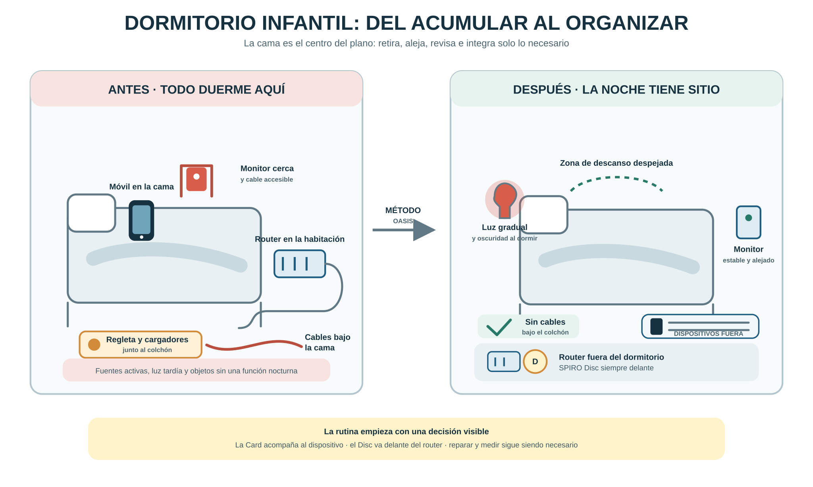

> **FIGURA 6.1 · Dormitorio infantil: del acumular al organizar.** Antes: móvil en la cama, vigilabebés pegado, router en la habitación, regleta junto al colchón, cables bajo la cama. Después: zona de descanso despejada, luz gradual, monitor estable y lejos, dispositivos fuera, router fuera del dormitorio. Referencia Codex: `oasis-dormitorio-infantil`, sin textos tapados.

## Receta 1 — Convierte su dormitorio en un Oasis Electromagnético

**Necesitas:** el plano, media hora y un sitio de carga fuera de la habitación. **Resultado:** una habitación donde la tecnología tiene horario y distancia.

1. **Dibuja la cama.** Marca la almohada y las paredes de al lado. Sitúa enchufes, regletas, cargadores, vigilabebés, radiadores, lámparas, router y lo que haya al otro lado del tabique.
2. **Retira lo que no necesita dormir.** Tabletas, consolas, auriculares, relojes conectados y cargadores sin uso. Cargar todo en otra zona evita que la habitación sea el aparcamiento nocturno de la familia.
3. **Aleja lo que se queda.** Lámpara, despertador y monitor, tan lejos de la cabecera como permita su función. Ni cables bajo la cama ni transformadores junto al colchón.
4. **Revisa la luz.** Menos intensidad antes de dormir y oscuridad, o la mínima luz de orientación. Si entra luz de la calle, oscurece sin impedir ventilar.
5. **Organiza la conexión.** Si la casa no necesita el router de noche, apágalo. Si debe seguir, fuera del dormitorio. Si has incorporado SPIRO, el Disc va delante del router; el porqué está en el capítulo 3.
6. **Comprueba la pared.** Si sospechas de la instalación o de algo al otro lado, no improvises: mide o pide una revisión. Ningún accesorio sustituye arreglar una toma de tierra o mover un cuadro.

## El recreo que también cuida los ojos

Un niño sale del colegio y escucha una pregunta automática:

—¿Has terminado los deberes?

Rara vez preguntamos:

—¿Cuánto cielo has visto hoy?

En 2015, Mingguang He y su equipo publicaron un ensayo con niños de seis años de doce colegios de Guangzhou, en China. A seis colegios les añadieron cuarenta minutos diarios de clase al aire libre y animaron a las familias a salir también. Tres años después, la miopía había aparecido en el 30,4 % de los niños que salían más y en el 39,5 % de los que seguían su rutina.

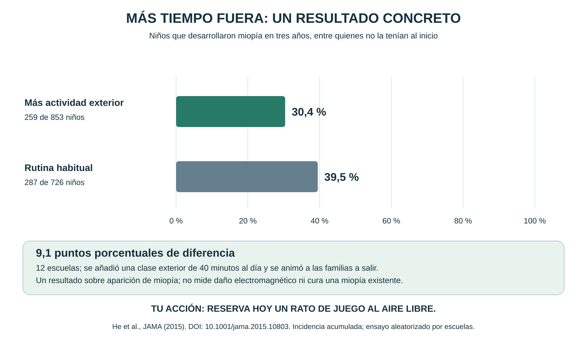

> **FIGURA 6.2 · Más tiempo fuera, menos miopía.** Dos barras horizontales sobre una escala de 0 a 100 %: "Más actividad exterior: 30,4 % (259 de 853 niños)" y "Rutina habitual: 39,5 % (287 de 726 niños)". Pie: "He et al., JAMA 2015. Doce colegios, tres años. Un resultado sobre aparición de miopía; no cura una miopía existente". Referencia Codex: `exterior-y-miopia`.

La miopía es hoy una epidemia: una proyección publicada en 2016 calcula que en 2050 la mitad de la población mundial será miope. Cuarenta minutos no son una dosis mágica ni curan la miopía que ya existe. Pero son una razón muy concreta para defender el patio, el paseo y el juego fuera.

Salir reúne luz, mirar a distintas distancias, movimiento y descanso de la pantalla. Reserva hoy un hueco con sitio en el horario: el camino al colegio, el patio, el paseo de la tarde.

No hace falta mandar al niño a tomar el sol hasta que se queme. Necesita tiempo fuera adaptado a la estación, a su piel y a la temperatura. La sombra también está fuera.

## El pupitre de casa

Ahora entramos en la tarde. Portátil sobre las piernas, cargador cruzando el sofá, móvil vibrando junto al cuaderno y la tableta con el vídeo de clase. El estudiante tiene cuatro herramientas abiertas y cinco motivos para no terminar la primera tarea.

Elige una mesa con luz suficiente y deja sobre ella lo necesario. La receta siguiente ordena el resto en pocos minutos.

## Receta 2 — Prepara una tarde de estudio

**Necesitas:** una mesa despejada y una hora de cierre. **Resultado:** una tarde con una sola pantalla abierta cada vez.

1. **Empieza con luz de fuera.** Al volver del colegio, un rato de caminar, jugar o merendar en la calle si se puede.
2. **Despeja el puesto.** Solo el dispositivo que necesita para la tarea. El móvil, fuera, si no forma parte del ejercicio.
3. **Conecta con intención.** Cable para el equipo fijo cuando sea viable. Si necesita Wi-Fi, solo las conexiones necesarias y lejos del router.
4. **Si usáis SPIRO**, la colocación es la del capítulo 3. No convierte una tarde larga de pantalla en descanso.
5. **Separa alimentación y cuerpo.** Cargadores, regletas y transformadores fuera de la zona de piernas y pies. Si la batería llega, desconecta el cargador.
6. **Una pausa que cambie de distancia.** Levantarse, mirar por la ventana, caminar. Mejor aún si es fuera.
7. **Cierra la jornada.** El material se guarda y los dispositivos vuelven a su sitio de carga, fuera del dormitorio.

## El primer móvil es un contrato invisible

El primer teléfono no llega solo. Con él entran una tarifa, una cámara, una red social, conversaciones privadas, vídeos infinitos, geolocalización y un despertador que intentará mudarse a la almohada.

Entregar el aparato sin acordar cómo se usa es firmar un contrato sin leerlo.

En 2018, Kate Bartel y sus colaboradores pidieron a sesenta y tres adolescentes que dejaran el teléfono durante la hora previa a dormir en noches de colegio. Comparado con su semana normal, durmieron veintiún minutos más y apagaron la luz diecisiete minutos antes. Fue un seguimiento corto y con diarios; es una pista para probar una rutina, no una promesa de minutos.

Retirar el móvil de la cama actúa a la vez sobre las notificaciones, el contenido y la tentación de seguir. Esos resultados no se pueden atribuir a la radiofrecuencia. Tampoco hace falta: funcionan.

La Asociación Española de Pediatría actualizó en 2024 sus recomendaciones: nada de pantallas antes de los seis años, muy poco tiempo después, y retrasar el primer móvil con Internet. Coincide con lo que verás en la receta siguiente, por motivos que no tienen nada que ver con los campos.

## Receta 3 — El pacto del primer móvil

**Necesitas:** al menor, un papel y quince minutos. **Resultado:** seis reglas escritas por los dos.

Escribe estas reglas con él. No las escondas en un discurso de cuarenta minutos.

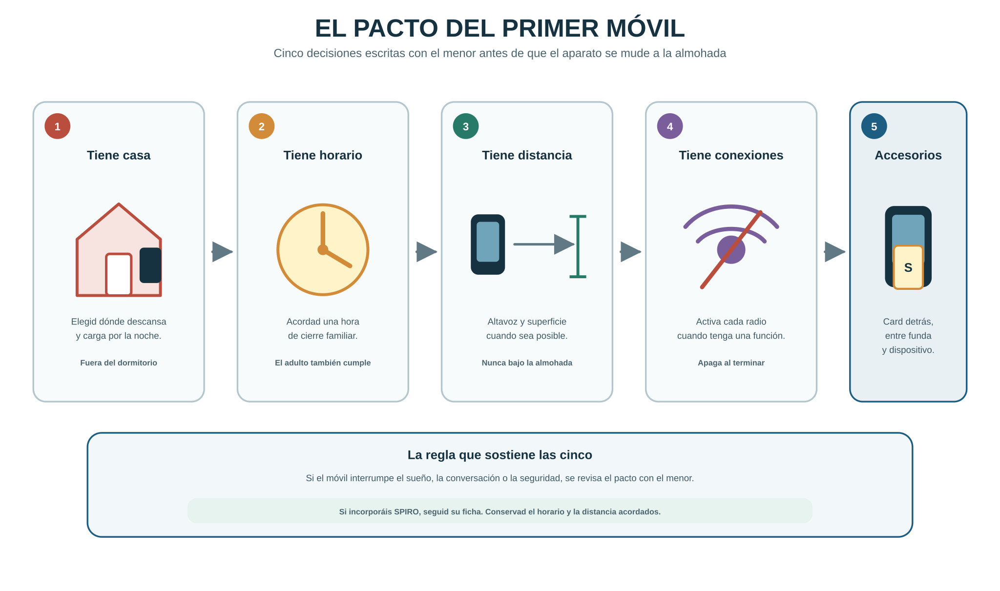

> **FIGURA 6.3 · El pacto del primer móvil.** Cinco tarjetas: tiene casa, tiene horario, tiene distancia, tiene conexiones, accesorios. Debajo: "La regla que sostiene las cinco: si el móvil interrumpe el sueño, la conversación o la seguridad, se revisa el pacto". Referencia Codex: `pacto-primer-movil`.

**El móvil tiene casa.** Elegid dónde descansa y carga. De noche se queda fuera del dormitorio. Si hace falta un despertador, uno que no tenga mensajes esperando.

**El móvil tiene horario.** Acordad una hora de cierre antes de dormir. El adulto cumple una regla equivalente. Si un día hay una necesidad especial, se explica y luego se vuelve a la rutina.

**El móvil tiene distancia.** Para llamadas largas, usa el altavoz o auriculares con cable. Mientras descarga o comparte Internet, se deja en una superficie, no pegado al cuerpo. No se guarda encendido bajo la almohada.

**El móvil tiene conexiones.** Wi-Fi, datos, Bluetooth y punto de acceso se activan cuando sirven para algo. El modo avión vale para actividades sin conexión, comprobando que las radios se apagan de verdad.

**El móvil tiene accesorios seguros.** Auriculares con cable, no inalámbricos. Si usáis SPIRO Card, sigue sus instrucciones y que no moleste a la funda ni a la carga. El accesorio no cambia el acuerdo sobre horario y distancia.

**El móvil se habla en familia.** Si aparece acoso, contenido perturbador, pérdida de sueño o la sensación de no poder soltarlo, no se resuelve confiscándolo en secreto. Se resuelve hablando, con límites y, cuando haga falta, con ayuda profesional.

## Lo que sabemos y lo que todavía estamos aprendiendo

En 2015, Anke Huss y su equipo estudiaron a 2361 niños de siete años. No encontraron un patrón que relacionara la radiofrecuencia ambiental con sus problemas de sueño; lo que sí se relacionaba con dormir mal era usar el móvil, es decir, la conducta. Ese mismo año, Anna Schoeni y sus colaboradores siguieron a 439 adolescentes y vieron que a mayor dosis estimada de radiofrecuencia en el cerebro, peor evolución de un tipo de memoria. Un estudio posterior del mismo grupo, con más participantes, encontró lo mismo.

Son estudios de observación, de edades y resultados distintos. No prueban que un móvil concreto cause insomnio o problemas de memoria. Tampoco permiten decir que no pase nada. Es lo que hay: una ciencia que todavía está mirando.

Puedo recomendar horarios, distancia y apagar lo que sobra sin asegurar un daño que esos trabajos no demuestran. Y puedo decirte lo que veo en las casas. Lo uno y lo otro son compatibles.

## ¿Y EKIO Light cuando hay niños?

Las bombillas organizan el ambiente; el panel aplica luz al cuerpo. Para iluminar la habitación, intensidad suficiente para la tarea y menos al preparar el descanso. Una bombilla roja no se deja toda la noche como tratamiento.

Con un panel, la conversación cambia. Un menor no es "medio adulto", y reducir a la mitad el tiempo de una receta adulta no es un protocolo infantil. Antes de encenderlo necesito cinco respuestas: qué objetivo, qué modelo, qué longitudes estarán activas, qué distancia y tiempo indica la guía y quién supervisará.

Si se plantea luz para dolor, piel, recuperación o cualquier problema de salud, la decisión va con un profesional que conozca la edad, la situación y los tratamientos del menor. El adulto se queda, evita que el niño mire los LED, usa la protección ocular indicada y para la sesión si aparece dolor, calor incómodo, irritación o malestar.

Los modos ultravioleta quedan fuera de cualquier rutina doméstica con niños. El panel no se deja en el dormitorio como lámpara, no se usa mientras el menor duerme y no sustituye una consulta cuando los síntomas persisten.

## Receta 4 — Un día conectado que todavía parece un día

| Momento | Qué buscamos | Acción familiar |
|---|---|---|
| Al despertar | Marcar el comienzo del día | Luz suave si aún es de noche; salir cuando aparezca la luz |
| Camino y colegio | Movimiento y entorno real | Caminar y aprovechar recreos fuera |
| Después de clase | Cambiar de distancia | Tiempo fuera antes de más pantalla |
| Estudio | Tecnología con una función | Mesa ordenada, distancia, conexiones necesarias, una tarea |
| Anochecer | Reducir la señal de día | Amarilla 1800 K, menos intensidad, cierre progresivo de pantallas |
| Última parte | Preparar el descanso | Roja DUSK, conversación, lectura, actividad tranquila |
| Noche | Proteger el sueño | Oscuridad y dispositivos cargando fuera del dormitorio |

No pretendas cambiarlo todo un lunes. Elige una acción que la familia pueda ver: crear el aparcamiento de móviles, sacar el router del dormitorio o empezar el paseo después del colegio. Cuando sea normal, añade la siguiente.

Los niños aprenden mucho de lo que decimos y todavía más de dónde dejamos el teléfono mientras hablamos con ellos.

Empieza esta noche: elegid juntos dónde cargarán los móviles. Tú deja el tuyo allí primero.

**En una frase:** un niño necesita cielo por la mañana, oscuridad por la noche y un móvil que duerma en otra habitación; lo demás se negocia.
# Capítulo 7 · Mascotas

En muchas casas españolas hay hoy más mascotas que niños. [Cifra a confirmar con el registro de animales de compañía y el INE antes de imprimir.] Compartimos con ellas el sofá, el dormitorio y, sin darnos cuenta, el router, la regleta y la luz de las once de la noche. Ellas no eligieron nada de eso. Nosotros sí.

En 2013, Vlastimil Hart y sus colaboradores siguieron durante dos años a setenta perros de treinta y siete razas mientras paseaban. Registraron 1893 deposiciones y 5582 micciones. Sí: alguien tuvo que anotar hacia dónde miraba cada perro en ese momento.

Encontraron una preferencia por alinearse en dirección norte-sur, sobre todo al defecar, en los días de calma magnética de la Tierra. La preferencia desaparecía cuando el campo terrestre se alteraba.

Es una observación curiosa sobre una posible sensibilidad al campo de la Tierra. No estudió el Wi-Fi ni ningún accesorio.

Y no convierte al perro en un medidor. Si se tumba junto al router, no está certificando la instalación. Si evita una esquina, tampoco demuestra que ahí haya un campo. Puede buscar calor, olor, silencio, sombra o el sitio desde el que mejor vigila la cocina.

Para cuidar su entorno hacemos lo mismo que con el nuestro: observar dónde pasa tiempo, ver qué hay alrededor y actuar sobre fuentes concretas.

## Empieza por donde descansa

El animal conoce la casa por sus lugares: la ventana soleada, la baldosa fresca, el rincón desde el que ve la cocina. Revisa sus tres lugares de más horas, no solo la cama que le compraste.

En cada uno busca:

- enchufes, regletas y transformadores;
- cables que pasen por debajo o por detrás;
- router, repetidores, bases de teléfono inalámbrico y altavoces inteligentes;
- frigorífico, congelador, cuadro eléctrico o bombas al otro lado de la pared;
- mantas, camas o suelos calefactados eléctricamente;
- cargadores, robot aspirador y bases de carga;
- cámaras, comederos, bebederos y juguetes conectados.

Una cama bajo la mesa puede quedar a pocos centímetros de la regleta y del cargador del portátil. Un gato que duerme sobre un mueble puede estar pegado al router que nosotros consideramos "alto y apartado". La distancia se mide desde el animal, no desde nuestros ojos.

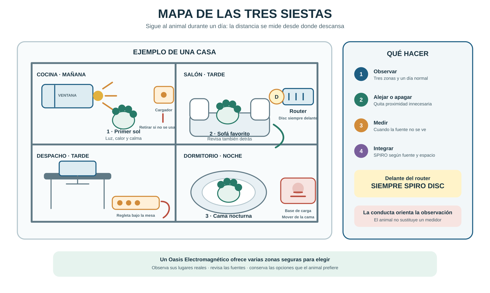

> **FIGURA 7.1 · El mapa de las tres siestas.** Planta con cocina (primer sol junto a la ventana, cargador cerca), salón (sofá favorito, router detrás), despacho (regleta bajo la mesa) y dormitorio (cama nocturna, base de carga al lado). A la derecha: observar, alejar o apagar, medir, integrar. Referencia Codex: `mapa-oasis-mascota`, con textos sin cortar.

## Receta 1 — El mapa de las tres siestas

**Necesitas:** un día normal y el plano de casa. **Resultado:** las fuentes alrededor de sus tres lugares de descanso.

1. **Observa un día normal.** Dónde duerme por la mañana, dónde descansa por la tarde y qué sitio elige de noche. Sofá, transportín, alfombra, rascador, suelo.
2. **Dibuja un círculo alrededor de cada zona.** Un metro, más o menos. Marca aparatos, enchufes, cables y lo que haya al otro lado de la pared. Primero completa el plano; no decidas todavía.
3. **Retira lo que no cumple una función.** Guarda cargadores, desenchufa fuentes sin uso, saca los dispositivos que solo han acabado ahí por comodidad. Ni cables bajo la cama ni al alcance de mordiscos.
4. **Aleja lo que debe funcionar.** Mueve la cama respecto a regletas, transformadores, motores y equipos inalámbricos. A veces treinta centímetros aparecen solo girando un mueble.
5. **Comprueba antes de convertir una sospecha en certeza.** Si la zona comparte pared con el cuadro, una instalación solar o un electrodoméstico grande, mide. El comportamiento del animal da una pista sobre sus preferencias; el instrumento responde a la pregunta física.

## El collar que también comunica

Los collares GPS resuelven un problema muy real: encontrar a un animal perdido. Al mismo tiempo, algunos mantienen comunicaciones móviles, Wi-Fi o Bluetooth pegadas al cuello.

Un rastreador útil merece mantenerse. Revisa cada cuánto actualiza, qué comunicaciones tiene activas y si puede quitarse en casa sin comprometer su seguridad. No dupliques collares inalámbricos para funciones que no usas. Un estudio de 2021 sobre estos dispositivos calculó exposiciones muy por debajo de los límites; con eso y con quitárselo en casa, el equilibrio es razonable.

No pegues una SPIRO Card ni ninguna pieza al collar sin una indicación de compatibilidad. El peso, la sujeción y el riesgo de mordida importan. Consulta con EKIO qué solución encaja alrededor de ese dispositivo y de la zona donde descansa.

## Una casa conectada para quien no usa aplicaciones

Abres el móvil y ves al gato en la cámara. El comedero confirma que ha servido la ración. La fuente registra el agua. El collar cuenta sus pasos. El robot limpia alrededor del arenero.

La mascota no ha abierto ninguna aplicación, pero vive dentro de todas.

Cada aparato puede ser útil. El problema aparece cuando olvidamos qué función justificaba mantenerlo encendido.

Una cámara que solo necesitas cuando viajas no tiene por qué transmitir todo el año. Un comedero puede conservar su horario sin conexión permanente, según el modelo. Una fuente de agua necesita una bomba, pero no necesariamente Wi-Fi. Una base de carga se puede llevar lejos de la cama.

Haz una pregunta por aparato: ¿qué pierdo hoy si lo desconecto?

Si la respuesta es "nada", apágalo. Si lo necesitas, aléjalo del descanso y deja solo las comunicaciones útiles.

Si has incorporado SPIRO, colócalo fuera del alcance del animal y, como en toda la casa, el Disc delante del router.

## Receta 2 — Audita el ecosistema conectado de tu mascota

**Necesitas:** cinco minutos con la lista de aparatos. **Resultado:** cada uno con una función y una decisión.

| Dispositivo | Función | Comunicación | Decisión |
|---|---|---|---|
| Cámara | Vigilar en una ausencia | Wi-Fi | Encender solo cuando haga falta |
| Rastreador | Localizar si se pierde | Red móvil, Bluetooth | Ajustar frecuencia y quitarlo en casa |
| Comedero | Servir horarios | Wi-Fi o local | Comprobar si funciona sin conexión continua |
| Fuente | Mover y filtrar agua | Bomba; Wi-Fi en algunos | Alejar el motor y desactivar extras |
| Robot aspirador | Limpiar | Wi-Fi y base eléctrica | Mover la base fuera de la zona de descanso |

Prueba el funcionamiento después de cada cambio: la cámara debe seguir sirviendo cuando la necesitas y el comedero no puede perder su horario por ahorrar una conexión.

## La luz también organiza su día

Un gato no es una persona pequeña con bigotes. Su visión, su conducta y sus horas de actividad son distintas. Aun así, perros y gatos tienen ritmos diarios y responden a la luz, la comida, la actividad y nuestra presencia.

En 2025, Alexandra Yaw y sus colaboradores estudiaron a 101 gatos durante cinco días en un refugio. Compararon luz normal, luz tenue y luz tenue con menos azul. Con esta última, los gatos en los que midieron cortisol, la hormona del estrés, tenían menos al quinto día.

El refugio no es tu salón y el cortisol no resume el bienestar de un gato. Pero refuerza una idea útil: la calidad y el horario de la luz forman parte del ambiente de un animal. Igual que del nuestro.

Durante el día, abre la casa a la luz natural y facilita un acceso seguro al exterior cuando la especie, el animal y el entorno lo permitan. Para un perro, el paseo de primera hora reúne luz, movimiento, olfato y contacto con el suelo. Para un gato de interior, una ventana segura, una terraza protegida o un patio controlado amplían el ambiente.

Al anochecer, reduce la luz blanca intensa. Puedes bajar la iluminación general con la amarilla de 1800 K o la roja DUSK, manteniendo visibilidad. Mantén siempre una zona más oscura a la que el animal pueda retirarse. Cuando la familia duerme, no dejes encendida una luz innecesaria.

No intentes obligar al gato a contemplar una bombilla roja. Si se marcha, ya ha expresado una preferencia bastante clara.

## Grounding sobre cuatro patas

Cuando un perro camina sobre tierra, hierba o arena, sus patas tocan una superficie natural. Al mismo tiempo se mueve, olfatea, recibe luz y explora. Para un gato con acceso seguro, el exterior ofrece texturas y señales que no existen sobre un suelo laminado.

No está demostrado que pasear descalzo proteja a la mascota de los campos electromagnéticos. El paseo aporta movimiento, exploración y luz; esos motivos bastan para disfrutarlo.

No conectes la cama, el cuenco ni el collar a una toma de tierra improvisada. Un animal puede morder, arañar, humedecer o desplazar un cable. Cualquier sistema interior debe estar diseñado para ese uso, con instalación comprobada y sin riesgos eléctricos ni de atrapamiento.

## Cuando la luz se convierte en una sesión veterinaria

La fotobiomodulación se ha estudiado para problemas veterinarios concretos. Dos ensayos ayudan a entender por qué importan la indicación y el equipo.

En 2022, João Alves y sus colaboradores publicaron un ensayo con veinte perros con artrosis en las dos caderas. Compararon tres semanas de láser terapéutico con un antiinflamatorio. El láser dio mejores resultados de dolor y función en varios controles. Era un ensayo pequeño con un láser clínico.

En cambio, Oscar Chavez y su equipo publicaron en 2023 un ensayo con 54 perros operados de la rodilla. La luz, comparada con una aplicación simulada, no produjo diferencias en dolor, apoyo ni inflamación.

La conclusión práctica: una mejoría con un láser en artrosis no valida cualquier panel para cualquier lesión. Un veterinario decide si EKIO Light es adecuado para ese animal y si dispone de los datos del panel para definir un protocolo. Si faltan, no improvises.

## El pelaje cambia la sesión

Imagina que intentas iluminar una mesa a través de una cortina. El color, el grosor y la separación cambian lo que llega al otro lado.

En 2020, Lindsay Hochman-Elam y su equipo midieron cuánta luz de dos láseres atravesaba los tejidos de 47 perros sanos. La longitud de onda, la potencia, el color del pelo y el rasurado influyeron. Pasó menos luz por las zonas oscuras y sin rasurar. Curiosamente, la longitud del pelo no fue lo que más importó.

No rasures ni subas la potencia por tu cuenta. Lleva esta pregunta al veterinario: "¿el pelaje y la zona que queremos tratar permiten aplicar el protocolo con este equipo?".

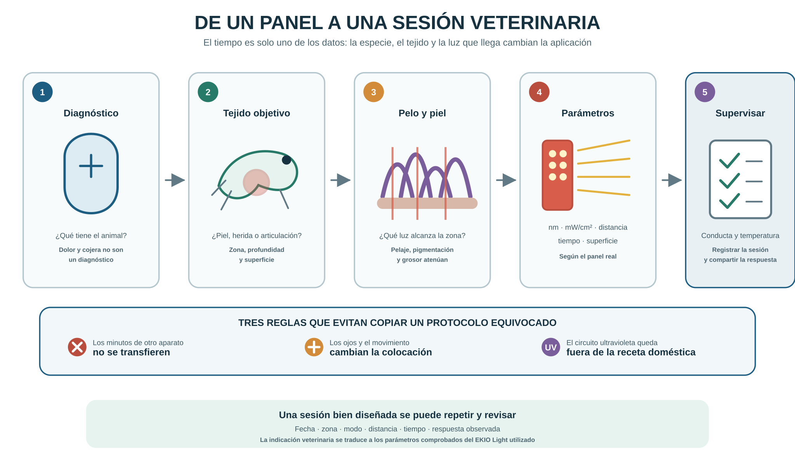

> **FIGURA 7.2 · De un panel a una sesión veterinaria.** Cinco pasos: diagnóstico, tejido objetivo, pelo y piel, parámetros, supervisar. Tres reglas: los minutos de otro aparato no se transfieren; los ojos y el movimiento cambian la colocación; el ultravioleta queda fuera. Referencia Codex: `sesion-pbm-mascota`.

## Receta 3 — Las preguntas antes de aplicar EKIO Light

**Necesitas:** una consulta con el veterinario. **Resultado:** saber si procede una sesión y con qué parámetros.

- **¿Qué se ha diagnosticado?** Dolor, cojera, herida, inflamación y falta de movimiento pueden tener causas distintas. La luz no sustituye explorar al animal.
- **¿Qué zona y qué profundidad?** Una herida superficial y una articulación bajo pelo y músculo no reciben la misma luz.
- **¿Qué modo del panel corresponde?** Longitudes activas, irradiancia a la distancia real, tiempo, superficie y frecuencia, según la guía del modelo.
- **¿Qué hacemos con el pelaje?** Lo decide el veterinario.
- **¿Cómo protegemos los ojos?** El animal no entiende que debe apartar la vista. Coloca el panel y al animal de forma que no mire los LED. Los circuitos ultravioleta quedan fuera. No aplicar sobre un tumor conocido o sospechoso.
- **¿Cómo sabremos si funciona?** Registra zona, modo, distancia, tiempo y respuesta. Graba el mismo recorrido antes y después; fotografía la piel con la misma luz y distancia. El veterinario decide qué cambio es relevante.

## Receta 4 — Realiza una sesión tranquila y supervisada

**Necesitas:** el protocolo aprobado por el veterinario. **Resultado:** una sesión que se puede repetir sin miedo.

1. **Prepara el espacio sin encender el panel.** Retira cables que pueda morder y asegura el soporte.
2. **Deja que conozca el lugar.** Su manta, una superficie antideslizante, una postura cómoda. Una sesión con miedo y forcejeo no es bienestar.
3. **Coloca la zona según el protocolo.** Mide la distancia desde la superficie emisora. El animal se mueve, y una distancia "aproximada" cambia la dosis a cada rato.
4. **Activa solo el modo indicado.** No enciendas todos los circuitos porque el panel los tenga. Programa el tiempo antes.
5. **Vigila temperatura y conducta.** Jadeo inesperado, intento de huida, agitación, dolor o irritación son motivos para parar. Nunca dejes al animal solo frente al panel.
6. **Registra la aplicación.** Fecha, zona, modo, distancia, tiempo y observación. Compártelo con el veterinario.

## Una mascota también necesita elegir

Un buen Oasis Electromagnético no encierra al animal en el único sitio que nosotros hemos decidido que es perfecto. Le ofrece opciones seguras.

Pon una cama en una zona tranquila y revisada, pero permite otro punto más fresco o más oscuro. Separa el cuenco de la base de carga. Apaga la cámara cuando estés en casa. Deja que el perro huela en el paseo y que el gato encuentre un rincón sin luz directa.

Tu mascota no puede leer una ficha técnica. Puede enseñarte dónde descansa, cuándo evita un sitio y cómo responde en una sesión. Tú pones el plano, la medición y la decisión.

La próxima vez que el perro tarde una eternidad en elegir dónde pararse, acuérdate de aquellos investigadores y sus 7475 anotaciones. Quizá esté leyendo algo del mundo que tú no ves.

O quizá solo haya encontrado el arbusto perfecto.

**En una frase:** tu mascota no eligió el router, la regleta ni la luz de las once; dale lo que tú también necesitas: distancia, oscuridad de noche y un rato de sol y tierra cada día.
# Capítulo 8 · Tu plan de higiene electromagnética

El cargador ha vuelto a la mesita. Nadie sabe quién reactivó el repetidor. El móvil que iba a dormir en el salón aparece otra vez bajo la almohada.

Una casa recupera sus costumbres con facilidad. Por eso quiero terminar con una lista que puedas usar. Elige tres cambios para esta semana: uno en el dormitorio, otro en tus dispositivos y otro en la luz o el tiempo fuera.

Para cada cambio, apunta qué harás, quién lo hará y cuándo lo comprobaréis. La intención necesita una fecha.

## Antes de empezar: una señal roja no espera

La higiene electromagnética empieza por una instalación segura.

Si notas olor a plástico quemado, ves chispas, humo, marcas oscuras, cables pelados, enchufes muy calientes, zumbidos o los automáticos saltan una y otra vez, deja de usar ese equipo y llama a un profesional. Y no conectes una regleta a otra para conseguir más tomas.

No midas radiofrecuencia mientras un enchufe se está quemando. Primero el riesgo eléctrico.

Para lo demás, tres preguntas:

- ¿Cuánto tiempo permanezco aquí?
- ¿A qué distancia está la fuente?
- ¿Puedo quitarla o alejarla sin perder algo importante?

Tiempo y distancia te dicen por dónde empezar.

> **FIGURA 8.1 · ¿Por dónde empiezo?** Arriba, una franja roja: "Urgente: seguridad eléctrica → profesional". Debajo, cinco filas numeradas: la noche, lo que toca tu cuerpo, donde permaneces, usos intensos, señales naturales, cada una con su acción. Pie: "Si dos acciones parecen iguales, empieza por la más cercana y prolongada". Referencia Codex: `prioridades-oasis-hogar`.

## Las cinco prioridades de tu casa

### Prioridad 1 — La noche

Empieza por las camas. Son donde más horas pasas quieto y donde menos tecnología necesitas.

Fuera el teléfono de la mesita, los cargadores, las regletas, los relojes conectados que no uses y los cables que cruzan el cabecero. Mira qué hay al otro lado de la pared. Si el router no hace falta de noche, apágalo. Si debe seguir, fuera del dormitorio y, si usas SPIRO, con el Disc delante.

Haz lo mismo con el dormitorio de los niños y con los sitios nocturnos de las mascotas. Cada persona y cada animal tiene su espacio; el criterio es el mismo: menos fuentes innecesarias cerca del descanso.

### Prioridad 2 — Lo que toca tu cuerpo

Después el móvil, la tableta, el portátil sobre las piernas, el reloj conectado, los auriculares inalámbricos y cualquier aparato que llevas pegado horas.

La primera decisión es física: separa el aparato cuando no necesite estar en contacto. Altavoz o auriculares con cable para llamadas largas. Nada de dormir con el móvil bajo la almohada. Nada de portátil sobre el cuerpo mientras carga.

La segunda es tecnológica: apaga conexiones y aplicaciones que no necesitas en ese momento.

Si incorporas SPIRO, el mapa está en el capítulo 3: Card para móvil o tableta, Square para el equipo y Disc delante del router. El producto no quita la necesidad de horarios y distancia.

### Prioridad 3 — Los lugares donde permaneces

El sofá y el puesto de trabajo acumulan muchas horas aunque no tengan almohada.

Mira debajo de la mesa, detrás del mueble y al otro lado de la pared. Aleja transformadores, bases de carga y regletas. Cablea lo fijo si encaja en tu casa. Apaga redes y puntos de acceso que no necesites. Tener datos móviles no significa transmitir todo el rato ni garantiza menos exposición que el Wi-Fi.

Si un problema parece venir del cableado, del cuadro, del inversor solar o de la instalación del vecino, una fotografía no basta. Pide una medición. En EKIO hacemos el Estudio Electromagnético del Hogar, con instrumentos y un informe de tu casa; tienes la información en nuestra web.

### Prioridad 4 — Los momentos de uso intenso

En la cocina, en el baño con el secador y en el cuarto de herramientas, la distancia importa mientras el aparato funciona.

No te apoyes en la placa de inducción. Da un paso atrás con el microondas y comprueba la puerta. Separa el secador de la cabeza lo que te deje peinarte. Apaga y desenchufa los pequeños electrodomésticos que han terminado.

No hace falta convertir cada uso en una ceremonia. Un hábito sencillo, repetido cada día, vale más que una revisión perfecta que nunca vuelves a hacer.

### Prioridad 5 — Recuperar las señales naturales

La higiene del entorno también es luz y horarios.

Sal cuando empieza el día. Si te levantas antes de que haya luz, la amarilla de 1800 K como transición. Cuando puedas, que los ojos encuentren el cielo, sin mirar al Sol.

Al anochecer, menos luz blanca. Pasa de la amarilla a la roja DUSK en las últimas horas y deja oscuridad para dormir. Aprovecha los paseos y los ratos seguros sobre tierra, hierba o arena para moverte, recibir luz y tocar el suelo.

Si usas un panel EKIO Light, el capítulo 5: objetivo, modo, distancia, tiempo y frecuencia.

## Tu revisión de diez minutos

Pon un temporizador. Recorre la casa con una hoja y apunta solo lo que puedes ver.

**Minutos 1 y 2 — Dormitorios**
- ¿Hay un teléfono junto a una cabeza?
- ¿Hay cargadores o regletas cerca de las camas?
- ¿El router o un repetidor está en el dormitorio?
- ¿Qué hay detrás del cabecero y al otro lado de la pared?

**Minutos 3 y 4 — Conexiones**
- ¿Cuántas redes crea la casa?
- ¿Qué equipos podrían ir por cable?
- ¿Hay un punto de acceso del móvil activado sin uso?
- ¿Qué aparato transmite toda la noche?

**Minutos 5 y 6 — Zonas de permanencia**
- ¿Qué hay bajo el escritorio?
- ¿Dónde descansa el teléfono mientras trabajas?
- ¿El sofá comparte pared con un router, un cuadro o un electrodoméstico?
- ¿Dónde duerme de verdad la mascota?

**Minutos 7 y 8 — Instalación**
- ¿Hay cables dañados, regletas encadenadas o enchufes calientes?
- ¿Hay fuentes de alimentación antiguas o ruidosas?
- ¿Se ha comprobado la instalación y la toma de tierra?
- ¿El inversor solar está cerca de una cama o un puesto fijo?

**Minutos 9 y 10 — Luz**
- ¿Entra luz de fuera por la mañana?
- ¿La casa mantiene luz blanca intensa al anochecer?
- ¿Hay oscuridad de verdad al dormir?
- ¿Las sesiones de EKIO Light tienen objetivo y registro?

Al terminar, rodea tres cambios. Uno para la noche, uno para el aparato que más usas y uno para recuperar luz o exterior. Esa es tu primera semana.

## Receta 1 — Tu semana OASIS

**Necesitas:** siete días y el plano. **Resultado:** tu primer Oasis Electromagnético con fecha.

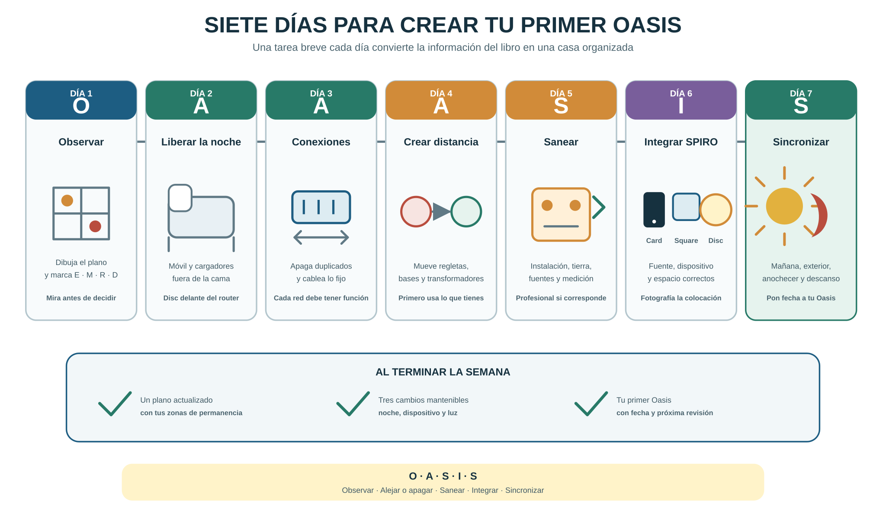

> **FIGURA 8.2 · Siete días para crear tu primer Oasis.** Siete tarjetas con la letra del método: O (día 1), A (2, 3, 4), S (5), I (6), S (7). Al pie, tres logros: plano actualizado, tres cambios mantenibles, primer Oasis con fecha. Referencia Codex: `plan-oasis-siete-dias`.

**Día 1 — Observar.** Dibuja camas, sofá, escritorio y zonas de las mascotas. Marca E, M, R y D. Es un inventario, no una medición.

**Día 2 — Liberar la noche.** Saca el teléfono de la zona de sueño, quita cargadores, revisa cables y decide qué pasa con el router. Deja preparadas la amarilla y la roja para el anochecer.

**Día 3 — Ordenar las conexiones.** Lista de routers, repetidores, bases inalámbricas, cámaras, altavoces y dispositivos conectados. Apaga lo que no tiene función. Cablea lo fijo. Decide dónde descansa cada móvil.

**Día 4 — Crear distancia.** Mueve regletas y transformadores. Reorganiza el escritorio. Separa la base del robot, el cargador y los equipos inalámbricos del sofá, las camas infantiles y las zonas de mascotas. No compres nada antes de ver cuánto mejoras moviendo lo que ya tienes.

**Día 5 — Sanear.** Inspección visual sin abrir cuadros ni enchufes. Encarga a un electricista la comprobación de la instalación y la toma de tierra. Prepara la medición si hace falta.

**Día 6 — Integrar.** Revisa las fuentes que has decidido mantener y, si has elegido SPIRO, comprueba su colocación. Guarda una fotografía para detectar desplazamientos.

**Día 7 — Sincronizar.** Sal por la mañana. Organiza la luz del atardecer. Prueba el horario nocturno de los dispositivos. Si usas EKIO Light, deja escritos objetivo y protocolo.

Al terminar, elige el primer Oasis Electromagnético de la casa. Puede ser el dormitorio, el salón o el despacho. Ponle fecha en el plano.

## Receta 2 — La tarjeta de cada momento

**Necesitas:** esta tabla en la nevera. **Resultado:** decidir sin releer el libro.

| Momento | Primero | Después | Si usas SPIRO o EKIO Light |
|---|---|---|---|
| Me levanto antes del amanecer | Luz suficiente para moverme | Salir cuando haya luz | Amarilla o roja de transición |
| Trabajo con ordenador | Ordenar cables y alejar transformadores | Cablear si es práctico; descansar la vista fuera | Card en el móvil; Square si corresponde |
| Hago una llamada larga | Separar el teléfono de la cabeza | Altavoz o cable | Card colocada |
| Cocino | Evitar proximidad innecesaria | Apagar al terminar | Revisar el conjunto de la estancia |
| Los niños estudian | Mesa despejada y luz adecuada | Móvil fuera de la tarea | Pausas y cierre de jornada |
| La mascota descansa | Revisar su zona real | Alejar bases, cables y equipos | Mantener otra zona disponible |
| Anochece | Reducir luz blanca | Amarilla y después roja DUSK | Preparar el descanso tecnológico |
| Voy a dormir | Teléfono fuera y cargadores lejos | Apagar conexiones innecesarias | Disc delante del router si sigue encendido |
| Uso un panel | Definir objetivo y modelo | Aplicar modo, distancia y tiempo | Registrar la sesión |

## Receta 3 — Mantén el Oasis durante treinta días

**Necesitas:** cinco minutos a la semana. **Resultado:** que el cambio aguante un mes.

Una casa vuelve despacio a su desorden. El cargador regresa a la mesita. El punto de acceso queda activo. La regleta que alejaste termina otra vez bajo tus pies.

**Semana 1: fotografía.** Guarda una imagen del dormitorio, el router, el escritorio y la colocación de SPIRO. La memoria suaviza los cambios; la foto conserva el punto de partida.

**Semana 2: funcionamiento.** Comprueba si alguien necesita de verdad lo que se apagó. Ajusta sin abandonar el objetivo. Una rutina que la familia no puede mantener necesita otra forma.

**Semana 3: dudas pendientes.** La app y el test "Auditoría del hogar" de la web te ayudan a ordenar observaciones. Si necesitas un número, hace falta un instrumento; un cuestionario no mide la vivienda.

**Semana 4: consolidación.** Actualiza el plano. Apunta qué queda encendido, dónde están Card, Square y Disc, cómo se organiza la luz y cuál será el siguiente Oasis.

Después, repite la revisión cuando cambie algo importante: una mudanza, un router nuevo, placas solares, una reforma, un electrodoméstico grande, una habitación infantil, un puesto de teletrabajo o una rutina nueva.

## Lo que no debe depender de la memoria

Deja esta tarjeta visible:

- [ ] Los dispositivos cargan sobre superficies ventiladas y fuera de las camas.
- [ ] Las conexiones imprescindibles siguen funcionando; las demás tienen horario.
- [ ] Cables, regletas y adaptadores están ordenados y sin señales de daño.
- [ ] Hemos revisado por separado los dormitorios infantiles y las zonas de las mascotas.
- [ ] Tenemos un momento fuera cada día y una transición de luz antes de dormir.
- [ ] Las sesiones de luz tienen un protocolo adecuado a quien las recibe.

Escribe debajo la próxima revisión: día ___ / responsable ___.

## Lo que significa vivir en un Oasis Electromagnético

Un espacio revisado y organizado: sabes qué está encendido, para qué sirve y qué decisiones has tomado. No es un certificado de que ahí no hay campos. Es una forma de vivir con la tecnología sin que ella decida por ti.

La distancia, la reparación y el apagado se comprueban sobre fuentes concretas. La luz y los horarios se ven en la rutina. SPIRO y EKIO Light tienen las funciones y los límites que te he explicado. Lo que mantiene el conjunto es volver a mirar cuando la casa cambia.

## Dos puertas para continuar

Los dos códigos QR del final te llevan a la web de EKIO y a nuestro canal de YouTube. En la web están la app, las fichas de cada producto, el Estudio Electromagnético del Hogar y los tests "Qué SPIRO necesito", "Auditoría del hogar" y "Qué EKIO Light necesito". En YouTube, las demostraciones, que iremos renovando.

El libro termina aquí. Tu mapa empieza ahora.

Elige una habitación. Haz la revisión de diez minutos. Rodea tres cambios. Y crea tu primer Oasis Electromagnético.

**En una frase:** tres cambios, siete días, una foto y una fecha; eso es todo lo que hace falta para empezar.
# Índice de recetas

**Capítulo 1 · La casa invisible**
1. Dibuja el mapa invisible de tu casa.

**Capítulo 2 · Un recorrido por tu hogar**
1. Prepara una mesita que te deje descansar.
2. Cocina sin vivir pegado a los aparatos.
3. Devuelve espacio al salón.
4. Construye un escritorio con espacio.

**Capítulo 3 · El teléfono que llevas encima**
1. Haz una auditoría de conexiones en dos minutos.
2. Prepara correctamente tu móvil con SPIRO.
3. Decide qué hacer con el router.
4. Revisa un coche eléctrico.

**Capítulo 4 · Volver a salir fuera**
1. Una mañana que el cuerpo pueda reconocer.
2. Grounding sin montar un laboratorio.
3. Devolver el anochecer a la casa.

**Capítulo 5 · Usar la luz en casa**
1. Lee tu panel antes de encenderlo.
2. Prepara una sesión local.
3. Organiza la luz de toda la casa.

**Capítulo 6 · Niños y adolescentes**
1. Convierte su dormitorio en un Oasis Electromagnético.
2. Prepara una tarde de estudio.
3. El pacto del primer móvil.
4. Un día conectado que todavía parece un día.

**Capítulo 7 · Mascotas**
1. El mapa de las tres siestas.
2. Audita el ecosistema conectado de tu mascota.
3. Las preguntas antes de aplicar EKIO Light.
4. Realiza una sesión tranquila y supervisada.

**Capítulo 8 · Tu plan de higiene electromagnética**
1. Tu semana OASIS.
2. La tarjeta de cada momento.
3. Mantén el Oasis durante treinta días.

---

# Índice de figuras

**Prólogo**
P.1 El camino que dio origen a este libro.

**Capítulo 1**
1.1 Cuatro lentes para mirar lo invisible.
1.2 El espectro electromagnético.
1.3 Las cuatro capas de tu casa.
1.4 Un aparato, varias capas.
1.5 Los instrumentos que usamos en EKIO (fotografía).
1.6 Una cuerda y una valla (nueva).
1.7 Método OASIS.
1.8 Mapa invisible de casa, ejemplo.

**Capítulo 2**
2.1 Cuatro habitaciones, cuatro prioridades.
2.2 La casa también cambia de luz.

**Capítulo 3**
3.1 El móvil cambia de papel.
3.2 Elige la conexión y revisa tus opciones.
3.3 Un coche eléctrico también tiene un mapa.

**Capítulo 4**
4.1 El reloj diario de luz, tierra y tecnología.
4.2 Qué cambia al tocar tierra.

**Capítulo 5**
5.1 Anatomía de una sesión de fotobiomodulación.
5.2 Qué hace la luz en el tejido (nueva).
5.3 La familia EKIO Light.

**Capítulo 6**
6.1 Dormitorio infantil: del acumular al organizar.
6.2 Más tiempo fuera, menos miopía.
6.3 El pacto del primer móvil.

**Capítulo 7**
7.1 El mapa de las tres siestas.
7.2 De un panel a una sesión veterinaria.

**Capítulo 8**
8.1 ¿Por dónde empiezo?
8.2 Siete días para crear tu primer Oasis.

**Figuras nuevas propuestas para Mauro, además de las anteriores:** distancia (mismo aparato a 1 cm y a 1 m); onda limpia frente a onda sucia; la pared compartida del cabecero (corte transversal con cuadro o frigorífico al otro lado).

---

# Glosario

**1800 K.** Temperatura de color de una luz muy cálida, con poco azul, parecida a la de una vela grande. En el libro, la bombilla amarilla para antes del amanecer y el anochecer.

**Armónico.** Ruido de frecuencia múltiplo de los 50 hercios de la red que añaden algunos aparatos electrónicos. Forma parte de lo que llamamos electricidad sucia.

**Bluetooth.** Comunicación inalámbrica de corto alcance por radiofrecuencia, usada por auriculares, relojes y altavoces.

**Campo eléctrico.** Campo asociado a la presencia de tensión. Existe alrededor de un cable o aparato enchufado aunque esté apagado.

**Campo electromagnético.** Nombre general para los campos eléctricos y magnéticos. Cerca de un cable de 50 Hz se miran por separado; en radiofrecuencia viajan juntos.

**Campo magnético.** Campo asociado al paso de corriente por cables, motores y aparatos. Se mide en microteslas (µT) o miligauss (mG); 1 µT son 10 mG.

**Canal iónico.** Proteína de la membrana de la célula que deja pasar determinados iones.

**Card X.** Formato SPIRO de mayor capacidad que la Card, para dispositivos personales.

**COB.** Módulo de LED agrupados en una sola pieza para concentrar la luz sobre una zona.

**DECT.** Tecnología de los teléfonos inalámbricos de casa. La base emite de forma continua salvo en modelos con modo eco.

**Dosis de luz.** Energía recibida por unidad de superficie, en julios por centímetro cuadrado (J/cm²). Depende de la irradiancia y del tiempo.

**DUSK.** Bombilla roja de EKIO Light para las últimas horas del día o para orientarse de noche.

**Electricidad sucia.** Ruido de frecuencias superiores a los 50 Hz, típicamente de kilohercios, superpuesto a la corriente de la red. No tiene un umbral sanitario oficial.

**Electrobiofotónica.** Marco divulgativo propuesto en este libro para mirar juntos electricidad, campos electromagnéticos, luz y biología.

**Electrohipersensibilidad.** Conjunto de síntomas que algunas personas atribuyen a la exposición a campos electromagnéticos. En España no está reconocida como enfermedad; en Suecia se trata como discapacidad funcional. La OMS describe los síntomas como reales y la causa como no establecida.

**Espectro electromagnético.** Ordenación de las ondas por su frecuencia, desde radio y microondas hasta luz, rayos X y gamma.

**Estudio Electromagnético del Hogar.** Servicio de EKIO: medición con instrumentos e informe de una vivienda.

**Fotobiomodulación.** Aplicación de luz, normalmente roja e infrarroja, con parámetros definidos para provocar una respuesta biológica sin calentar el tejido.

**Frecuencia.** Número de oscilaciones por segundo, en hercios (Hz).

**Grounding.** Contacto conductor del cuerpo con la Tierra. Cambia la tensión del cuerpo respecto al suelo; no demuestra protección frente a campos.

**Ion.** Átomo o grupo de átomos con carga eléctrica. Ca²⁺ y Mg²⁺ son iones de calcio y magnesio.

**Irradiancia.** Potencia de luz que llega a una superficie, en mW/cm². Siempre va con una distancia.

**J/cm².** Julios por centímetro cuadrado. Unidad de dosis de luz.

**Longitud de onda.** Distancia entre dos puntos iguales de una onda. En luz se expresa en nanómetros y describe el color.

**Macroescala, microescala, nanoescala.** Las escalas de la casa, de la célula y de la molécula.

**Modo pulsado.** Emisión de luz que se enciende y apaga muy rápido. Cambia la dosis real y requiere precaución en personas con epilepsia fotosensible.

**mW/cm².** Milivatios por centímetro cuadrado. Unidad de irradiancia.

**Nanómetro (nm).** Milmillonésima parte de un metro. Unidad de las longitudes de onda de la luz.

**Oasis Electromagnético.** Espacio revisado para reducir fuentes evitables, organizar las necesarias y preparar el descanso y la actividad. Nombre del enfoque de EKIO, no un certificado.

**OASIS.** Método del libro: Observar; Alejar o apagar; Sanear; Integrar; Sincronizar.

**PLC.** Adaptadores que llevan Internet por el cableado eléctrico de la casa.

**Polarización de la materia.** Cómo se orientan o desplazan las cargas dentro de una molécula o un tejido bajo un campo. No es lo mismo que la polarización de una onda.

**Polarización de una onda.** Orientación en la que oscila el campo eléctrico de una onda. La de la cuerda y la valla.

**Potencial de membrana.** Diferencia de tensión entre el interior y el exterior de una célula.

**Power 19.** Nombre de investigación de un disco SPIRO usado en el estudio de vehículos de 2025; equivale al Disc X del catálogo.

**Punto de acceso (hotspot).** Función del móvil que crea una red Wi-Fi para compartir su conexión.

**Radiación ionizante.** Radiación con fotones capaces de romper enlaces en la materia: rayos X, gamma y el ultravioleta más energético.

**Radiación no ionizante.** Radiación cuyos fotones no tienen esa energía: radiofrecuencia, microondas, infrarrojo, luz visible y parte del ultravioleta. Los campos de la red eléctrica también son no ionizantes.

**Radiofrecuencia.** Parte del espectro usada para transmitir información: telefonía, Wi-Fi, Bluetooth, radio, televisión.

**Ritmo circadiano.** Ritmo biológico de unas veinticuatro horas, puesto en hora sobre todo por la luz y la oscuridad.

**SAR.** Tasa de absorción específica: energía de radiofrecuencia absorbida por kilo de tejido en unas condiciones de ensayo. El límite europeo para el móvil es de 2 W/kg promediado en 10 gramos.

**SPIRO Card.** Formato para el móvil o la tableta, entre la funda y el aparato.

**SPIRO Disc.** Formato para espacios. En EKIO se coloca delante del router.

**SPIRO Disc X.** Formato para focos como inversores solares o vehículos eléctricos.

**SPIRO Disc Ultra.** Formato para zonas urbanas muy densas o personas que refieren alta sensibilidad. Selección comercial, no indicación médica.

**SPIRO Square.** Formato para un ordenador, una tableta o un asistente de voz.

**SPIRO Square X.** Formato portátil para trabajo, viajes y otros espacios.

**Stroom Master.** Filtro enchufable distribuido por EKIO para el ruido de la red eléctrica.

**Temperatura de color.** Cuánto tira una luz blanca hacia el naranja (números bajos, cálida) o hacia el azul (números altos, fría). Se mide en kelvin (K).

**Toma de tierra de seguridad.** Parte de la instalación eléctrica que protege en caso de fallo. No es el grounding corporal.

**TPLO.** Operación de rodilla en perros para reparar la rotura de un ligamento.

**UV-A y UV-B.** Regiones del ultravioleta. Requieren precauciones específicas y quedan fuera de las recetas domésticas del libro.

**Wi-Fi.** Tecnología inalámbrica para crear redes locales.

---

# Bibliografía

Las referencias van aquí para no cargar la lectura. En el texto, cada estudio se identifica por autor, año, cuántas personas o animales participaron y qué se midió. Aquí puedes ir al original y leer sus límites.

## Escalas, microscopía y espectro
- Alberts B, Johnson A, Lewis J et al. (2002). *Molecular Biology of the Cell*, 4.ª ed. Garland Science.
- NASA. The Electromagnetic Spectrum. science.nasa.gov.
- Royal Institution. Michael Faraday's generator. rigb.org.

## Campos electromagnéticos y mecanismos celulares
- Catterall WA. (2011). Voltage-gated calcium channels. *Cold Spring Harbor Perspectives in Biology* 3:a003947.
- Christ A et al. (2012). Exposure of the human body to professional and domestic induction cooktops compared to the basic restrictions. *Bioelectromagnetics* 33:695-705. DOI 10.1002/bem.21739.
- Feissner RF et al. (2009). Crosstalk signaling between mitochondrial Ca²⁺ and ROS. *Frontiers in Bioscience* 14:1197-1218.
- Pall ML. (2013). Electromagnetic fields act via activation of voltage-gated calcium channels to produce beneficial or adverse effects. *Journal of Cellular and Molecular Medicine* 17:958-965.
- Panagopoulos DJ, Johansson O, Carlo GL. (2015). Polarization: a key difference between man-made and natural electromagnetic fields, in regard to biological activity. *Scientific Reports* 5:14914. Modelo teórico.
- Peng TI, Jou MJ. (2010). Oxidative stress caused by mitochondrial calcium overload. *Annals of the New York Academy of Sciences* 1201:183-188.
- Platano D et al. (2007). Acute exposure to low-level CW and GSM-modulated 900 MHz radiofrequency does not affect Ba²⁺ currents through voltage-gated calcium channels in rat cortical neurons. *Bioelectromagnetics* 28:599-607. DOI 10.1002/bem.20345.
- Wood A, Karipidis K. (2021). Radiofrequency fields and calcium movements into and out of cells. *Radiation Research* 195:101-113. Revisión crítica de la hipótesis anterior.

## Instrumentos mostrados
- LATNEX. HF-B8G Pro Triple Axis RF Meter.
- LHY Audio. Line EMI Meter.
- Mastfuyi. FY876 Electromagnetic Field Tester.
- Safe Living Technologies. Safe and Sound Pro II.

## Historia de la tecnología
- Apple. (2007). Apple reinvents the phone with iPhone.
- Motorola Solutions. (1973). Nota de la primera llamada con el DynaTAC.
- Nobel Prize. The 2017 Nobel Prize in Physiology or Medicine.
- Nobel Prize. Niels Ryberg Finsen, 1903.

## Aparatos y seguridad doméstica
- Electrical Safety First. Extension leads, cable reels and block adaptors.
- U.S. Food and Drug Administration. Microwave Ovens.

## Vehículos eléctricos
- European Commission, Joint Research Centre. (2020). Assessment of low-frequency magnetic fields in electrified vehicles. EUR 30198 EN.

## Ritmos circadianos, luz exterior y grounding
- Brainard GC et al. (2001). Action spectrum for melatonin regulation in humans. *Journal of Neuroscience* 21:6405-6412.
- Brown R. (2016). Effects of grounding on body voltage and current in the presence of electromagnetic fields. *Journal of Alternative and Complementary Medicine* 22:757-759. DOI 10.1089/acm.2015.0340.
- Chamberlin K et al. (2014). Analysis of the charge exchange between the human body and ground. *Journal of Chiropractic Medicine* 13:239-246.
- Chang AM et al. (2015). Evening use of light-emitting eReaders negatively affects sleep, circadian timing, and next-morning alertness. *PNAS* 112:1232-1237. DOI 10.1073/pnas.1418490112.
- Chevalier G. (2010). Changes in pulse rate, respiratory rate, blood oxygenation, perfusion index, skin conductance, and their variability induced during and after grounding human subjects for 40 minutes. *Journal of Alternative and Complementary Medicine* 16:81-87.
- Danilenko KV et al. (2000). Phase advance after one or three simulated dawns in humans. *Chronobiology International* 17:659-668.
- de Mairan JJ. (1729). Observation botanique. *Histoire de l'Académie Royale des Sciences*.
- Ghaly M, Teplitz D. (2004). The biologic effects of grounding the human body during sleep. *Journal of Alternative and Complementary Medicine* 10:767-776.
- Konopka RJ, Benzer S. (1971). Clock mutants of Drosophila melanogaster. *PNAS* 68:2112-2116.
- Nakahata Y et al. (2009). Circadian control of the NAD⁺ salvage pathway by CLOCK-SIRT1. *Science* 324:654-657.
- Ostrin LA. (2017). Objectively measured light exposure in emmetropic and myopic adults. *Optometry and Vision Science* 94:229-238.
- Tan DX, Reiter RJ, Zimmerman S, Hardeland R. (2023). Melatonin: both a messenger of darkness and a participant in the cellular actions of non-visible solar radiation of near infrared light. *Biology* 12:89.
- Wright KP Jr et al. (2013). Entrainment of the human circadian clock to the natural light-dark cycle. *Current Biology* 23:1554-1558.

## Fotobiomodulación
- Anders JJ, Lanzafame RJ, Arany PR. (2015). Low-level light/laser therapy versus photobiomodulation therapy. *Photomedicine and Laser Surgery* 33:183-184.
- de Paiva PRV et al. (2016). Photobiomodulation therapy and/or cryotherapy in skeletal muscle restitution. *Lasers in Medical Science* 31:1925-1933.
- Luna GLF et al. (2020). Biphasic dose/response of photobiomodulation therapy on culture of human fibroblasts. *Photobiomodulation, Photomedicine, and Laser Surgery* 38:413-418.
- Quirk B, Whelan HT. (2021). Effect of red-to-near infrared light and a nitric oxide donor on oxygen consumption of isolated cytochrome c oxidase. *Photobiomodulation, Photomedicine, and Laser Surgery* 39:463-470.
- Wang Y et al. (2017). Red (660 nm) or near-infrared (810 nm) photobiomodulation stimulates, while blue (415 nm), green (540 nm) light inhibits proliferation in human adipose-derived stem cells. *Scientific Reports* 7:7781.
- Wunsch A, Matuschka K. (2014). A controlled trial to determine the efficacy of red and near-infrared light treatment in patient satisfaction, reduction of fine lines, wrinkles, skin roughness, and intradermal collagen density increase. *Photomedicine and Laser Surgery* 32:93-100.

## Niños, adolescentes, pantallas y radiofrecuencia
- Akacem LD et al. (2018). Sensitivity of the circadian system to evening bright light in preschool-age children. *Physiological Reports* 6:e13617.
- Asociación Española de Pediatría. (2024). Recomendaciones sobre el uso de pantallas en la infancia y la adolescencia. aeped.es.
- Bartel K et al. (2019; en línea 2018). Altering adolescents' pre-bedtime phone use to achieve better sleep health. *Health Communication* 34:456-462.
- Foerster M et al. (2018). A prospective cohort study of adolescents' memory performance and individual brain dose of microwave radiation from wireless communication. *Environmental Health Perspectives* 126:077007.
- He M et al. (2015). Effect of time spent outdoors at school on the development of myopia among children in China: a randomized clinical trial. *JAMA* 314:1142-1148. DOI 10.1001/jama.2015.10803.
- Holden BA et al. (2016). Global prevalence of myopia and high myopia and temporal trends from 2000 through 2050. *Ophthalmology* 123:1036-1042.
- Huss A et al. (2015). Environmental radiofrequency electromagnetic fields exposure at home, mobile and cordless phone use, and sleep problems in 7-year-old children. *PLoS ONE* 10:e0139869.
- Schoeni A et al. (2015). Memory performance, wireless communication and exposure to radiofrequency electromagnetic fields. *Environment International* 85:343-351.

## Animales de compañía
- Alves JC et al. (2022). A randomized double-blinded controlled trial on the effects of photobiomodulation therapy in dogs with osteoarthritis. *American Journal of Veterinary Research* 83(8). DOI 10.2460/ajvr.22.03.0036.
- Chavez OA et al. (2024; en línea 2023). Photobiomodulation therapy in dogs undergoing TPLO after cranial cruciate ligament rupture shows promise but no statistically significant difference in a randomized trial. *American Journal of Veterinary Research* 85(2). DOI 10.2460/ajvr.23.06.0138.
- Hart V et al. (2013). Dogs are sensitive to small variations of the Earth's magnetic field. *Frontiers in Zoology* 10:80.
- Hochman-Elam LN et al. (2020). Effects of laser power, wavelength, coat length, and coat color on tissue penetration using photobiomodulation in healthy dogs. *Canadian Journal of Veterinary Research* 84:131-137.
- Klune J et al. (2021). Tracking devices for pets: health risk assessment for exposure to radiofrequency electromagnetic fields. *Animals* 11:2721.
- Yaw AM et al. (2025). Light quality and time in shelter modulate behavior and cortisol in the domestic cat. *iScience* 28:112709.

## Electrohipersensibilidad
- Organización Mundial de la Salud. (2005). Electromagnetic fields and public health: electromagnetic hypersensitivity. Nota descriptiva 296.

## SPIRO: documentación del fabricante y del distribuidor (no constituye evidencia clínica)
- MORLAB. (2015). Informe SZ15100123S01. Ensayo de SAR de un teléfono con y sin SPIRO Card Level 2, encargado por Noxtak Technologies. Enlace en electrosmogespana.com.
- Machado J. (2025). Evaluation of EMF exposure in Tesla Model Y (2021/2022) and testing the efficiency of SPIRO technology: an environmental bioelectrography study. *Journal of Applied Biotechnology & Bioengineering* 12(4):131-143. DOI 10.15406/jabb.2025.12.00395. El autor es el inventor de SPIRO.
- Machado J. *Contaminación electromagnética. Gestionando los riesgos de las tecnologías de información y comunicación en la era de la hiperconectividad.* Serie "Sin miedo al voltaje". Autoedición.
- EKIO Electrosmog. Fichas de SPIRO Card, Square, Square X, Disc, Disc X, Disc Ultra y Stroom Master. electrosmogespana.com.
- Reconocimientos de SPIRO: Silicon Valley Invention Festival (2019), Edison Award (2020), German Innovation Award (2021). [Confirmar categorías y medallas exactas antes de imprimir.]

## EKIO Light: documentación de producto
- EKIO Light. Fichas vigentes de Core, Deep 5, Bio Regén 7, Bio Spectrum 11, bombilla amarilla 1800 K y bombilla roja DUSK. electrosmogespana.com.

---

# Agradecimientos

A las personas con sensibilidad química múltiple y electrohipersensibilidad que compartieron conmigo cómo vivían y descansaban, y me enseñaron a mirar de otra manera los lugares que habitamos. Sus experiencias están en el origen de mi búsqueda.

A quienes han dedicado años a estudiar la electricidad, la luz, los campos electromagnéticos y la biología. Sus trabajos me han permitido hacer mejores preguntas y entender que una respuesta útil también debe reconocer sus límites.

A Joaquín Machado y al equipo de Noxtak, por SPIRO.

Al equipo de EKIO y a las personas que nos han confiado la revisión de sus hogares. Cada conversación, cada medición y cada duda concreta han ayudado a convertir un asunto complejo en decisiones cotidianas.

Y a ti, que has llegado hasta aquí. Este libro cobra sentido cuando dibujas tu propio mapa, cambias un hábito y compartes con otra persona una forma más consciente de convivir con la tecnología.

---

# Recursos de EKIO

## Web de EKIO Electrosmog

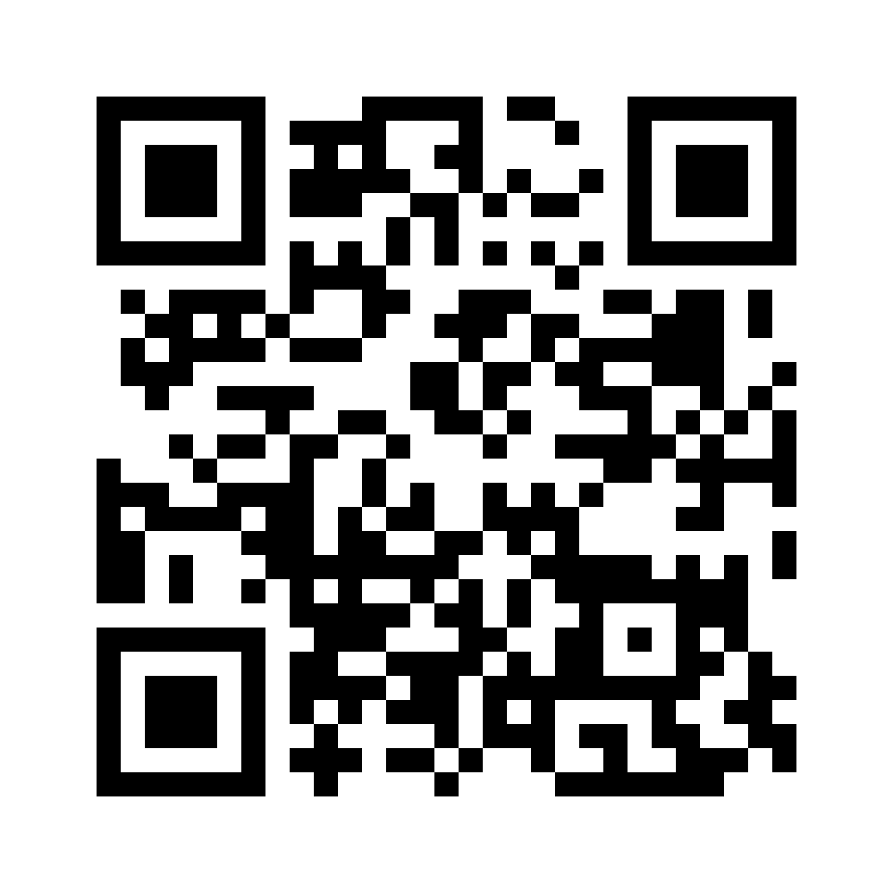

https://electrosmogespana.com/

En la web encontrarás:
- la app de EKIO;
- el test "Qué SPIRO necesito";
- la "Auditoría del hogar";
- el test "Qué EKIO Light necesito";
- el Estudio Electromagnético del Hogar;
- las fichas vigentes de cada producto, guías y recursos actualizados.

Los tests organizan información y orientan la elección. No sustituyen una medición, una inspección eléctrica ni un diagnóstico.

## Canal de YouTube de EKIO Electrosmog

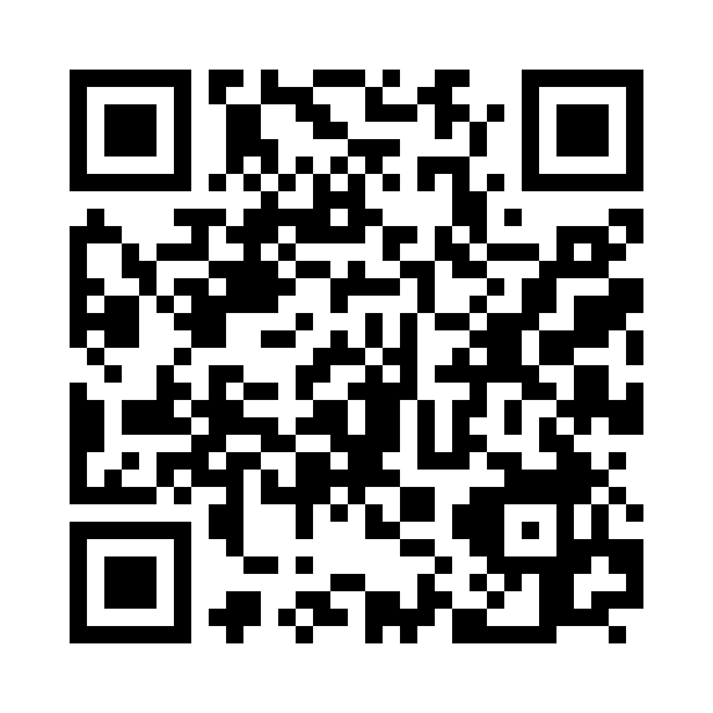

https://www.youtube.com/@EkioElectrosmog

El canal reúne explicaciones y demostraciones que se renuevan sin cambiar las direcciones impresas en este libro.

Si no puedes escanear un código, escribe en el navegador la dirección que hay junto a él.

---

# Sobre el autor

Javier Andrés es naturópata, fundador y director de EKIO Electrosmog.

Está al frente de EKIO desde 2011. Entre 2011 y 2012 comenzó a trabajar con personas con sensibilidad química múltiple y electrohipersensibilidad. Escuchar sus experiencias cambió su forma de mirar los hogares, especialmente los dormitorios y los lugares donde más horas pasamos.

Desde entonces ha dedicado su actividad a la divulgación, la revisión de viviendas y la distribución de tecnologías para organizar el entorno electromagnético. Su trabajo con SPIRO y la creación de EKIO Light forman parte de esa búsqueda.

En este libro propone la electrobiofotónica como marco para mirar juntas la electricidad, los campos electromagnéticos, la luz y la biología, y el método OASIS para observar, alejar o apagar, sanear, integrar y sincronizar.

Su objetivo es convertir un tema invisible y complejo en decisiones que cualquier persona pueda entender y aplicar en su casa.

Web: electrosmogespana.com · YouTube: @EkioElectrosmog

---

# Nota de la edición

La revisión documental de esta edición se cerró el 13 de septiembre de 2026.

La ciencia, la tecnología, los modelos de producto y los contenidos digitales evolucionan. Consulta la bibliografía y la documentación vigente de los productos antes de aplicar una instrucción técnica.

Si detectas una errata o una referencia que necesita actualización, utiliza los canales de contacto de la web de EKIO.
# Para contar este libro en dos minutos

Apéndice para el autor, para quien lo entreviste y para la contraportada. Frases cortas, cada una sostenida por un capítulo.

## El libro en una frase
Vivimos dentro de cajas, sin sol, sin oscuridad y sin tocar la tierra, rodeados de aparatos que no vemos. Este libro te enseña a mirar tu casa y a devolverle al cuerpo lo que espera cada día.

## Diez frases que se pueden decir en la radio

1. **"Túmbate en tu cama y mira lo que hay a un brazo de distancia. Por ahí empieza tu casa."** (cap. 2)
2. **"En tu casa hay cuatro cosas invisibles, y la herramienta contra todas es la misma: distancia."** (cap. 1)
3. **"Apagar una lámpara no es desenchufarla. El cable sigue con tensión toda la noche junto a tu cabeza."** (cap. 1)
4. **"El móvil no es malo. Lo malo es no saber nunca qué está haciendo, a qué distancia lo tienes y dónde duerme."** (cap. 3)
5. **"El cambio más grande que puedes hacer en tu casa cuesta dos bombillas: dejar de tratar a la noche como si fuera de día."** (prólogo, cap. 2)
6. **"Doce adultos, cinco noches leyendo en una pantalla antes de dormir: la melatonina se retrasó y por la mañana estaban peor. No es tu imaginación."** (cap. 4)
7. **"Doce colegios en China, cuarenta minutos más de patio al día. Tres años después, nueve de cada cien niños se libraron de las gafas."** (cap. 6)
8. **"Las bombillas son para vivir; los paneles, para una sesión. El error es usar un panel como lámpara y una lámpara como tratamiento."** (cap. 5)
9. **"Tu perro no eligió el router, la regleta ni la luz de las once. Dale lo que tú también necesitas."** (cap. 7)
10. **"Tres cambios, siete días, una foto y una fecha. Eso es todo lo que hace falta para empezar."** (cap. 8)

## Cinco preguntas que le harán a Javier, y la respuesta corta

**¿El Wi-Fi es peligroso?**
No te voy a decir que sí ni que no. Te voy a decir que el router no tiene por qué estar en tu dormitorio, que puedes apagarlo de noche y que eso no cuesta nada. Lo que sí sé es que las casas donde se hace eso duermen mejor.

**¿Y la electrosensibilidad existe?**
Llevo desde 2011 trabajando con personas que la sufren. En España no está reconocida; en Suecia sí, como discapacidad funcional. La OMS dice que los síntomas son reales y la causa no está establecida. Yo no discuto con la OMS: entro en sus casas y las ordeno con ellas.

**¿Qué es SPIRO y funciona?**
Es una tecnología de Joaquín Machado y su empresa, Noxtak, con premios internacionales de innovación y ensayos de laboratorio encargados por el fabricante. No tiene todavía ensayos clínicos grandes, porque nadie los ha pagado. Yo lo distribuyo, lo digo en la primera página del libro, y lo pongo después de todo lo que puedes hacer gratis.

**¿Qué hago esta noche cuando llegue a casa?**
Saca el móvil del dormitorio, quita la regleta de debajo de la cama y baja la luz una hora antes de acostarte. Mañana, sal a la calle antes de mirar la pantalla. Con eso ya has hecho más que la mayoría.

**¿Y los niños?**
Cielo por la mañana, oscuridad por la noche y un móvil que duerma en otra habitación. Lo demás se negocia. Y el adulto deja el suyo allí primero.

## Tres datos con fuente para un titular
- Un ensayo con 952 escolares en Guangzhou: 40 minutos diarios más al aire libre redujeron la aparición de miopía del 39,5 % al 30,4 % en tres años (He et al., *JAMA*, 2015).
- 63 adolescentes que dejaron el móvil una hora antes de dormir: 21 minutos más de sueño y la luz apagada 17 minutos antes (Bartel et al., 2018).
- Ocho adultos, una semana de acampada sin luz eléctrica: su reloj interno se alineó con el sol (Wright et al., *Current Biology*, 2013).

## Lo que Javier no dirá nunca en una entrevista
- Que un producto cura, trata o previene una enfermedad.
- Que la radiofrecuencia causa una enfermedad concreta.
- Que su medidor demuestra que SPIRO funciona.
- Una cifra de un panel que pueda cambiar con la próxima revisión de hardware.
